# 全文检索

## 概念


相当于是有两个步骤：

1、索：也就是建立索引，将一段文本进行相关的切分，形成许多词，同时记录出现的位置及次数

文本------》切分-------》词    文章出现过   出现多少次

2、检索：也就是查询。当我们输入一个关键词后，会去索引中进行搜索，返回符合条件的结果，并通过记录的出现的次数来进行相关度的排序

关键词------》索引中-----》符合条件的文章    相关度排序


## 特点


全文检索具有以下特点：

1、只处理文本，不处理语义

比如，搜索“你吃饭了吗？”只会进行文本的搜索，并不会返回“我吃了”。现在像百度，Google等，也有相关简单地语义处理，比如搜索“今天是几号”，可能会返回一个日历

2、搜索时英文不区分大小写

比如搜索“Spring”、“spring”、“SPRING”时返回的结果是一致的

3、结果列表有相关度排序

比如，搜索一个关键字时，那些内容显示在最前面，哪些排在后面


# ElasticSearch

## 简介

### 什么是ElasticSearch

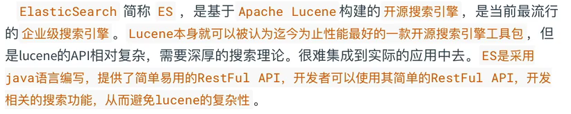

### ElasticSearch的诞生

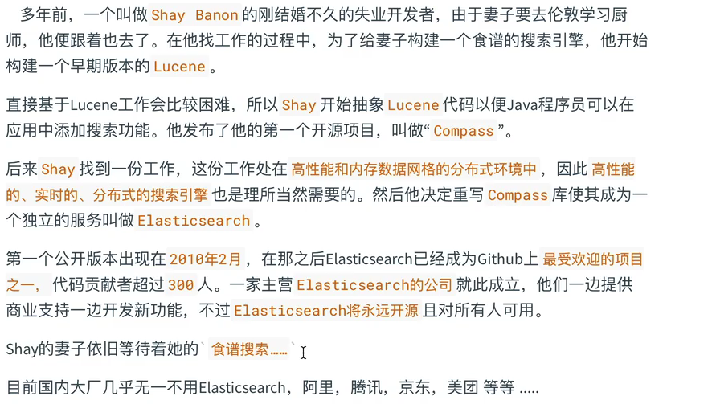


## 安装

### 传统方式安装

0、环境准备

````
(1)操作系统：常见的操作系统都可以，比如CentOS7.X+、Ubuntu、Windows、macOS。这里以Ubuntu为例
(2)安装JDK11.0+ 并配置环境变量。注意如果本机安装的版本是11版本以下，比如jdk8,也无需卸载重新安装，因为ES安装包中已经给我们预装了JDK
````

1、下载ES

````
https://www.elastic.co/cn/elasticsearch/
````


2、安装（注意：安装ES不能使用root用户，需要创建普通用户）

创建用户的命令如下：


tips：如果命令行前面是$证明是普通用户，如果是#代表是root用户

3、用创建的普通用户进行解压缩操作

````
tar -zxvf elasticsearch-7.14.0-linux-x86_64.tar.gz 
````

4、查看ES解压包中的目录结构


其中data目录在刚解压完成未运行时是没有的，需要运行后才有。

5、启动ES服务

使用普通用户，切换到ES安装目录下的bin目录中，直接输入命令./elasticsearch即可启动

```
meng@ubuntu:~/software/elasticsearch-7.14.0/bin$ ./elasticsearch
如果想后台启动，需要加参数-d
meng@ubuntu:~/software/elasticsearch-7.14.0/bin$ ./elasticsearch -d

启动成功后可以使用  ps -ef|grep elasticsearch 命令查看进程
```

如果此时你的电脑已经装有JDK，并且低于JDK11，那么将会抛出错误，并且可以使用以下两种方式解决：


配置环境变量：


配置完成之后使用source /etc/profile命令重新加载，或者直接重启机器

```
source /etc/profile	重新加载
```

然后重新启动ES服务

6、访问ES

默认启动的ES是无法通过外网进行访问的，可以通过Linux中的curl命令进行测试

```
http://localhost:9200
9200是web端口，也就是restful风格的端口，TCP的端口是9300
```


7、停止ES服务

```
正常的启动，可以在ES的启动窗口按CTRL+C结束进程。

如果是通过后台方式./elasticsearch -d启动的，可以配合进程搜索命令ps -ef|grep elasticsearch查看进程号，使用 kill -9 进程号	去杀死进程
```

8、开启远程访问


```
vim elasticsearch.yml
设置配置文件中的network.host属性，注意yml的语法格式，:后面需要有空格
network.host: 0.0.0.0
```

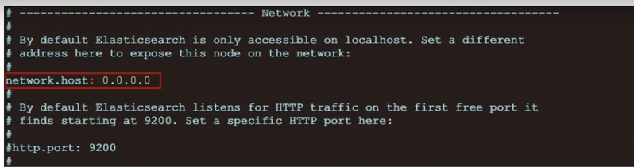

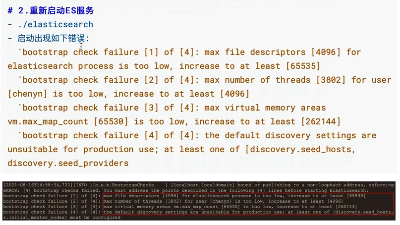

注意不同的Linux系统，报错可能会不同，注意分别解决即可

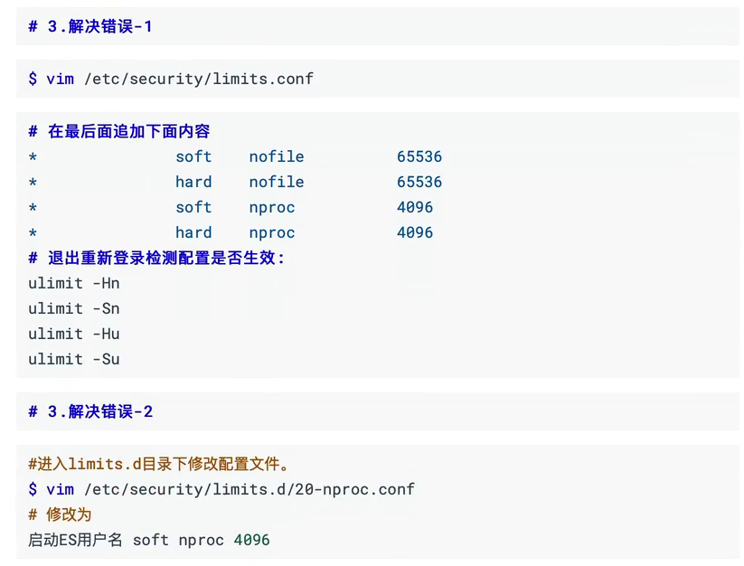

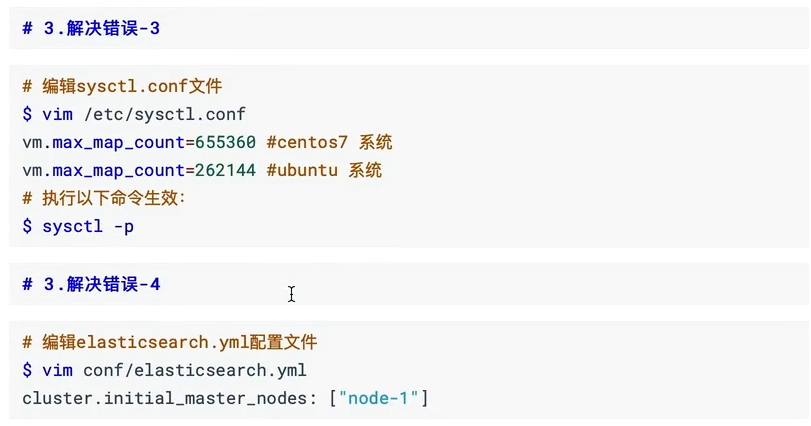

### Docker方式安装

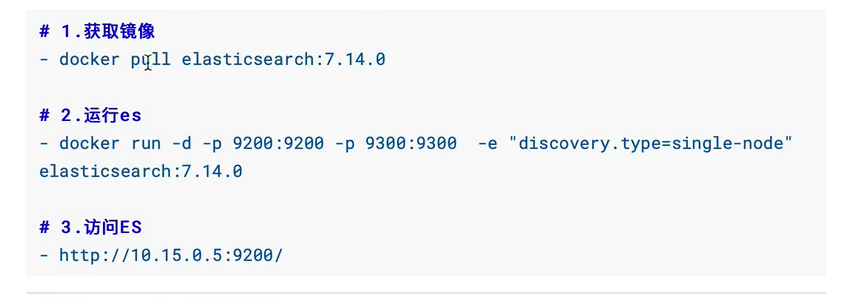

## Kibana

### 简介


### 安装

#### 传统方式安装

要注意下载的kibana版本要和ES版本保持一致，这里下载的是7.14.0，同时在安装kibana时，一定要注意启动ES

1、下载Kibana

```
https://www.elastic.co/cn/downloads/kibana
```

2、安装下载的Kibana

```
tar -zxvf kibana-7.14.0-linux-x86_64.tar.gz
```

3、编辑kibana的配置文件

```
vim /kibana安装目录/config/kibana.yml
```

4、修改如下配置

```
server.host: "0.0.0.0"	#开启kibana的远程访问
elasticsearch.hosts: ["http://localhost:9200"]	#配置ES的服务器地址
```

5、启动kibana

```
kibana安装目录/bin下执行
./kibana
```

6、访问kibana的web界面

```
http://地址:5601	#kibana默认端口为5601
如: http://192.168.11.128:5601/
```

#### docker方式安装

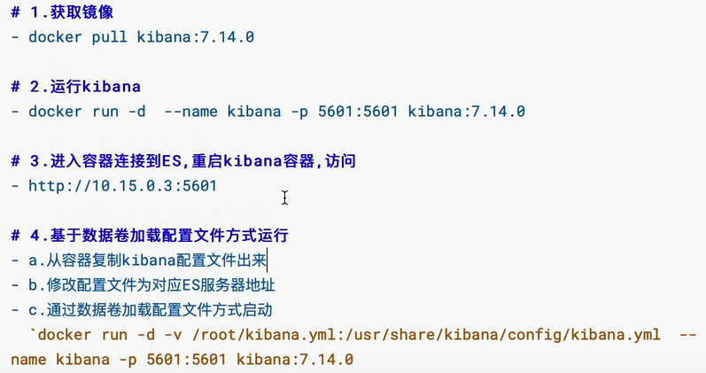

#### compose方式安装

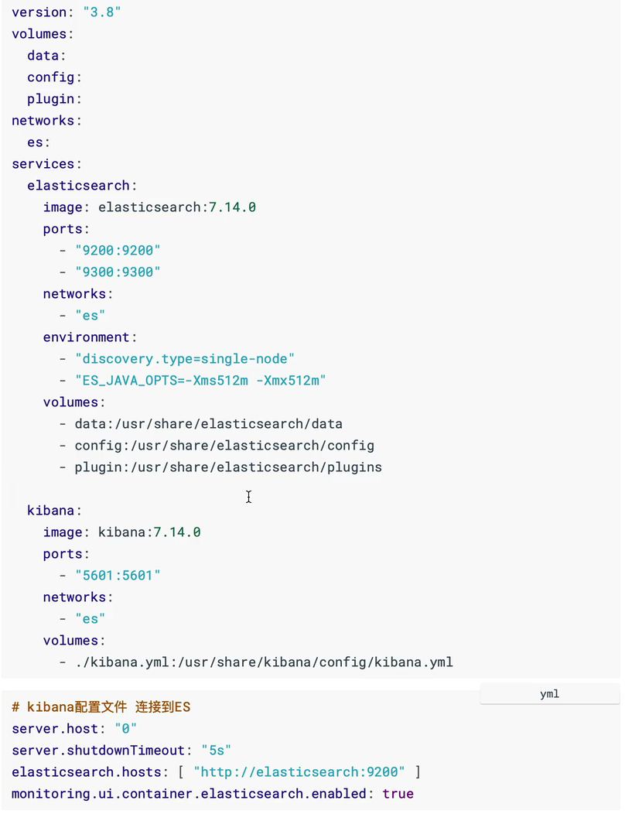

## 核心概念

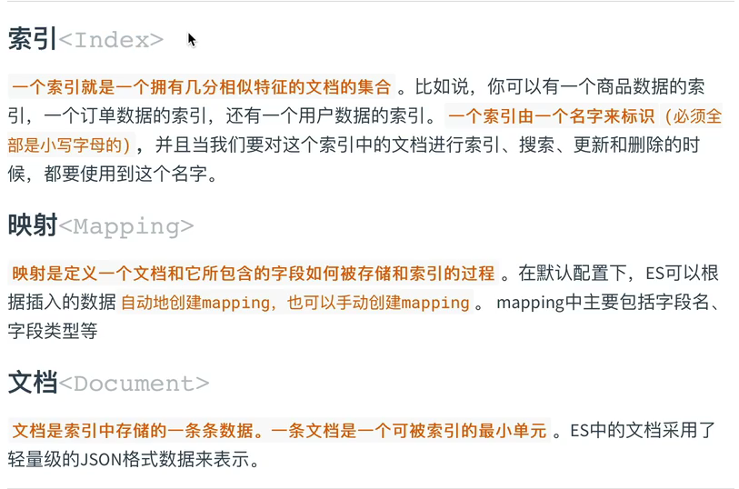

在ES7.X中索引相当于mysql中的表，mapping相当于mysql中的Schema主要存储字段的类型等信息，文档相当于mysql中的数据行。

这里说明几个概念：

1、正排索引

像我们平时mysql中的数据行，第一行数据id为1001，内容是XXX

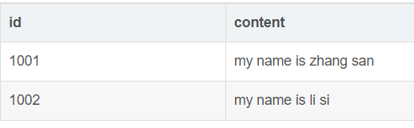

2、倒排索引

在ES中使用的是倒排索引，包含关键词name的有id为1001,1002的数据

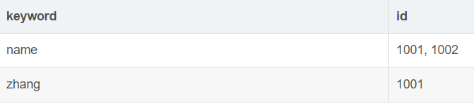

有了倒排索引，这样表的概念慢慢就弱化了，所以在ES7.X中就将原先Type的概念直接移除了，在ES7.X以前版本的对应关系


## 基本操作

### 索引<index>

索引只能创建、查询、删除，不能修改

#### 创建

1、创建索引

注意：

（1）ES中索引健康状态：

red（索引不可用）

yellow（索引可用，但存在风险）

green（索引健康）

（2）默认ES在创建索引时会为索引创建一个备份索引和一个primary索引

```json
PUT /索引名	例如:PUT /products
这时候创建的索引健康状态为yellow，rep备份分片为1，因为主分片为1，副本分片为1 ，并且位于同一台机器上，会存在风险
```

2、创建索引，并进行索引分片配置

```json
PUT /orders
{
  "settings": {
    "number_of_shards": 1,  #指定主分片的数量
    "number_of_replicas": 0 #指定副本分片的数量
  }
}
此时创建的索引，健康状态为green
```

#### 查询

```json
#查看ES中的所有索引
GET /_cat/indices
#开启详细输出
GET /_cat/indices?v
```

#### 删除

```json
DELETE /索引名
例如：
DELETE /products
DELETE /*	*代表通配符，代表所有索引
```

### 映射<mapping>

ES中常见的字段类型：

具体详见https://www.elastic.co/guide/en/elasticsearch/reference/7.15/mapping-types.html


#### 创建

映射的创建不能单独进行，必须在创建索引的时候，使用mapping字段去进行指定

```json
#创建一个索引为products，mapping信息包含id,title,price,create_at,description
PUT /products
{
  "settings": {
    "number_of_shards": 1,
    "number_of_replicas": 0
  },
  "mappings": {
    "properties": {
      "id":{
        "type": "integer"
      },
      "title":{
        "type": "keyword"
      },
      "price":{
        "type": "double"
      },
      "create_at":{
        "type": "date"
      },
      "description":{
        "type": "text"
      }
    }
  }
}
```

#### 查询

```json
#查看某个索引的映射信息
GET /索引名/_mapping
例如：
GET /products/_mapping
```

需要注意：映射信息不允许修改，如果发现错误，只能将索引删除掉，然后重新建立索引和映射

### 文档<document>

#### 添加文档

```json
#添加文档操作，手动指定文档id，ES中用_id字段存储ID
POST /products/_doc/1
{
  "id":1,
  "title":"小浣熊",
  "price":0.5,
  "created_at":"2022-12-11",
  "description":"小浣熊真好吃"
}
```

```json
#添加文档操作，自动生成文档id，是采用UUID生成的
POST /products/_doc
{
  "title":"日本豆",
  "price":1.5,
  "created_at":"2022-12-11",
  "description":"日本豆很不错"
}
```

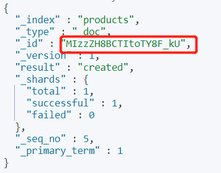

#### 查询文档

```json
#文档查询操作 基于id查询
GET /products/_doc/MIzzZH8BCTItoTY8F_kU
```

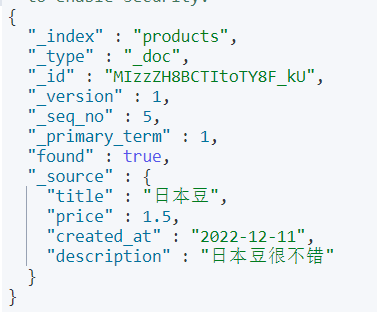

#### 删除文档

```json
#删除文档操作，基于id删除
DELETE /products/_doc/MIzzZH8BCTItoTY8F_kU
```

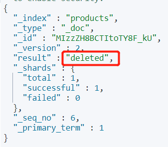

#### 更新文档

```json
#更新文档
这样更新的文档会删除原始文档，然后再重新添加，所以此时只有title一个属性
PUT /products/_doc/1
{
  "title":"小浣熊1号"
}
```

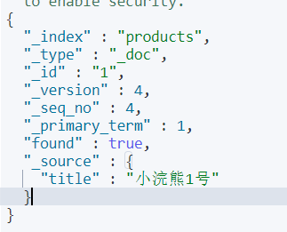

出现这种问题可以有两种方式解决：

```json
#第一种方式
#在更新时，传递全部字段进行更新，将原先字段的内容传递过来
PUT /products/_doc/1
{
  "title":"小浣熊1号",
  "price":0.5,
  "created_at":"2022-12-11",
  "description":"小浣熊真好吃"
}
```

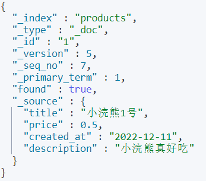

```json
#第二种方式：这种方式会先根据ID将内容先查询出来，然后再去更新。可以将数据原始内容保存，并在此基础上进行更新
#更新操作，基于指定的字段进行更新
POST /products/_doc/1/_update
{
  "doc":{
    "price":1.6,
    "title":"小浣熊"
  }
}

```

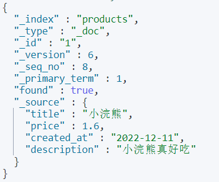

#### 批量操作

```json
#文档批量操作
#批量添加,"index"代表的是添加操作，"_id"代表指定ID值，#{"index":{}}这样代表自动生成ID
POST /products/_doc/_bulk
{"index":{"_id":2}}
{
  "id":2,
  "title":"小浣熊2号",
  "price":2.5,
  "created_at":"2022-12-11",
  "description":"小浣熊2号真好吃"
}
{"index":{"_id":3}}
{
  "id":3,
  "title":"小浣熊3号",
  "price":3.5,
  "created_at":"2022-12-11",
  "description":"小浣熊3号真好吃"
}
这样直接会报错
```

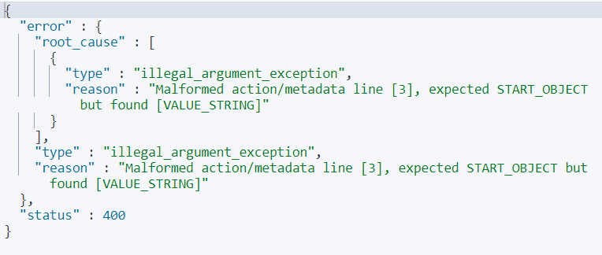

原因在于，如果是批量添加数据，不论数据多少，都不应格式化，应该在同一行

```json
POST /products/_doc/_bulk
{"index":{"_id":2}}
{"id":2,"title":"小浣熊2号","price":2.5,"created_at":"2022-12-11","description":"小浣熊2号真好吃"}
{"index":{"_id":3}}
{"id":3,"title":"小浣熊3号","price":3.5,"created_at":"2022-12-11","description":"小浣熊3号真好吃"}
```

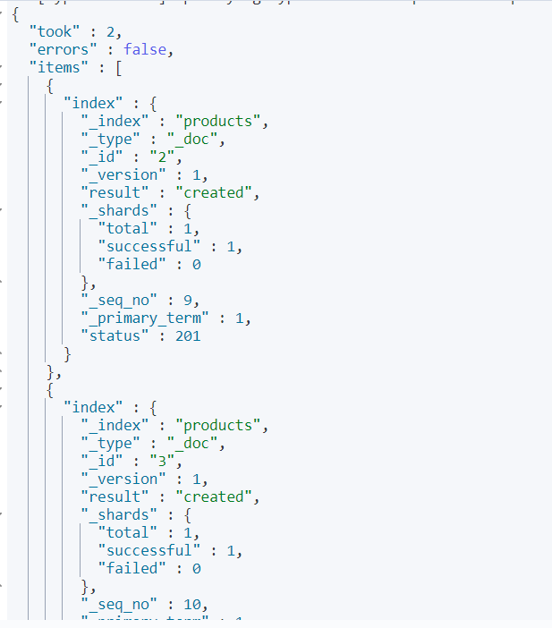

```json
#更新操作，其中包括添加、更新、删除
POST /products/_doc/_bulk
{"index":{}}
{"title":"小浣熊4号","price":4.5,"created_at":"2022-12-11","description":"小浣熊4号真好吃"}
{"update":{"_id":3}}
{"doc":{"title":"小浣熊3号更新"}}
{"delete":{"_id":2}}
```

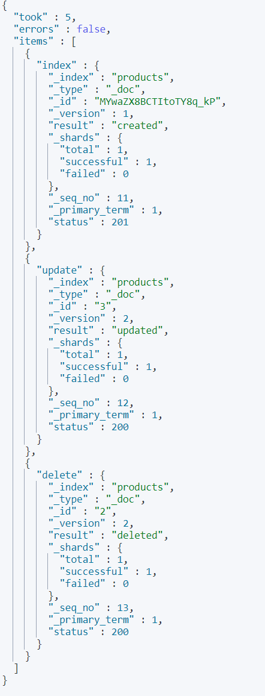

需要注意的是：虽然这是一个批量操作，但是每条结果都是单独返回的，也就是说他们之间每一条都是单独运行的，并不是一个原子操作，不会说因为某一条失败而全部失败

## 高级查询


### 语法

#### 查询所有：[match_all]

match_all关键字：返回索引中的全部文档

```json
GET /索引名/_doc/_search{json格式请求体数据}
或者可以简化成：
GET /索引名/_search{json格式请求体数据}

例如：
GET products/_doc/_search
{
  "query":{
    "match_all":{}
  }
}
或者
GET /products/_search
{
  "query": {
    "match_all": {}
  }
}
```

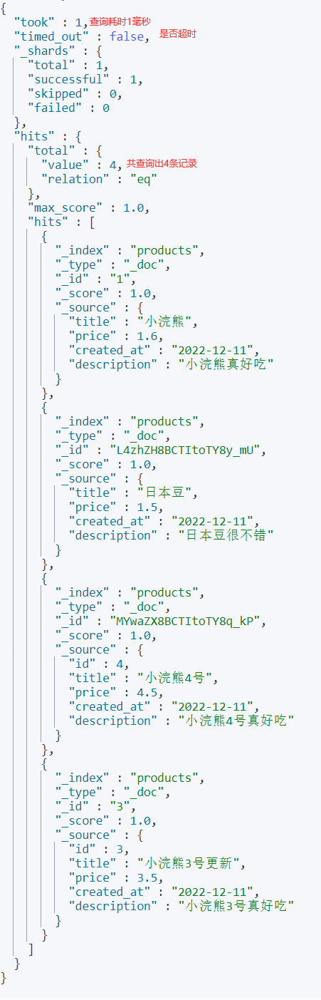

#### 关键词查询[term]

term关键字：用来使用关键词查询

```json
#基于关键字查询
GET /products/_search
{
  "query": {
    "term": {
      "title": {
        "value": "小浣熊"
      }
    }
  }
}
需要注意：
1、在ES的Mapping type中的keyword、date、integer、long、double、boolean、ip这些类型不分词，只有text类型分词。在上面创建products索引时，title的类型为keyword。所以title不会分词，只有查询的title值和数据值完全一致时才能查到，所以这里如果写成
GET /products/_search
{
  "query": {
    "term": {
      "title": {
        "value": "浣熊"
      }
    }
  }
}
那么将会查询不到结果

2、对于分词的字段，ES中默认使用标准分词器（StandardAnalyzer），即对于中文是单字分词，对英文是单词分词
例如，description字段是text类型，默认分词的
GET /products/_search
{
  "query": {
    "term": {
      "description": {
        "value": "熊"
      }
    }
  }
}
这样会查询出description中包含“熊”的，但是如果
GET /products/_search
{
  "query": {
    "term": {
      "description": {
        "value": "好吃"
      }
    }
  }
}
这样则查询不出结果，因为中文默认是单字分词

对于英文而言则是单词分词，比如插入一条文档，描述是“very good”
POST /products/_doc/6
{
  "id":6,
  "title":"小浣熊6号",
  "price":5.5,
  "created_at":"2022-12-11",
  "description":"very good"
}
那么使用very或者good都可以查询到
GET /products/_search
{
  "query": {
    "term": {
      "description": {
        "value": "very"
      }
    }
  }
}
或者
GET /products/_search
{
  "query": {
    "term": {
      "description": {
        "value": "very"
      }
    }
  }
}
这两条查询语句都可以查询到
```

#### 范围查询[range]

查询指定范围内的文档

```json
#范围查询  gt大于 gte大于等于 lt小于 lte小于等于
GET /products/_search
{
  "query": {
    "range": {
      "price": {
        "gte": 0,	#代表大于等于0，小于等于5
        "lte": 5
      }
    }
  }
}
```

#### 前缀查询[prefix]

用来检索含有指定前缀的关键词的相关文档

```json
GET /products/_search
{
  "query": {
    "prefix": {
      "title": {
        "value": "小浣"
      }
    }
  }
}
这里查询的title字段类型是keyword，是不分词的，所以这里以“小浣”开头的记录都能查到，但是如果换成查询description
GET /products/_search
{
  "query": {
    "prefix": {
      "description": {
        "value": "小浣"
      }
    }
  }
}
那么这里的description是text类型，是分词的，而且标准分词器默认中文是单字分词，既然是单字那么查询“小浣”开头的肯定是不存在，所以这样就查询不出记录，如果是英文是可以的，因为英文是单词分词
GET /products/_search
{
  "query": {
    "prefix": {
      "description": {
        "value": "good"	#或者"value": "g"或者"value": "go"等都可以
      }
    }
  }
}
```

#### 通配符查询[wildcard]

通配符查询：?用来匹配一个任意字符 *用来匹配多个任意字符

```json
GET /products/_search
{
  "query": {
    "wildcard": {
      "description": {
        "value": "goo?"	#匹配goo开头，后面只有一个字符，并且可以是任意字符
      }
    }
  }
}

或者
GET /products/_search
{
  "query": {
    "wildcard": {
      "description": {
        "value": "go*"	#匹配go开头，后面可以有多个，并且可以是任意字符
      }
    }
  }
}
```

#### 多id查询[ids]

值为数组类型，用来根据一组id获取多个对应的文档

```json
GET /products/_search
{
  "query": {
    "ids": {
      "values": [1,2,3,4,5,6]
    }
  }
}
查询出id是1,2,3,4,5,6的
```

#### 模糊查询[fuzzy]

用来模糊查询含有指定关键字的文档

需要注意:

fuzzy模糊查询，最大的模糊次数要在0-2之间

搜索关键词长度为2不允许存在模糊

搜索关键词长度为3-5允许模糊一次

搜索关键词长度大于5允许模拟两次

```json
为了测试方便，这里先插入一条数据
POST /products/_doc/10
{
  "id":10,
  "title":"小浣熊牌干脆面",
  "price":0.5,
  "created_at":"2022-12-11",
  "description":"小浣熊牌干脆面真好吃"
}

模糊查询，这里我们以title字段进行查询，title的字段长度为7，可以允许模糊两次
GET /products/_search
{
  "query": {
    "fuzzy": {
      "title": "小浣熊牌干脆面" #此时完全匹配可以查到
    }
  }
}

GET /products/_search
{
  "query": {
    "fuzzy": {
      "title": "小狗熊牌干脆面" #此时有一个字不同，也就是一次模糊，也可以查到
    }
  }
}

GET /products/_search
{
  "query": {
    "fuzzy": {
      "title": "小狗狗牌干脆面" #此时有两个字不同，也就是两次模糊，也可以查到
    }
  }
}

GET /products/_search
{
  "query": {
    "fuzzy": {
      "title": "小狗狗牌干干面" #此时有三个字不同，也就是三次模糊，不能查到
    }
  }
}

```

#### 布尔查询[bool]

用来组合多个条件实现复杂的查询

must：相当于&&，要同时成立

should：相当于||，成立一个就可以

must_not：相当于！，任何一个都不能满足

```json
#查询ID为1并且title为“小浣熊”的记录
GET /products/_search
{
  "query": {
    "bool": {
      "must": [
        {
          "ids": {
            "values": [1]
          }
        },{
          "term": {
            "title": {
              "value": "小浣熊"
            }
          }
        }
      ]
    }
  }
}
```

#### 多字段查询[multi_match]

```json
GET /products/_search
{
  "query": {
    "multi_match": {
      "query": "小浣熊",
      "fields": ["title","description"]
    }
  }
}
会用查询参数“小浣熊”分别去查询title字段和description字段
需要注意的是：
1、如果字段是不分词的，比如title字段，那么他就会把参数作为一个整体去查，比如这里会将“小浣熊”作为一个整体去title字段查询
2、如果字段是分词的，比如description字段，那么他就会按照分词规则将参数进行分词，因为这里是标准分词器，中文是单字分词，所以这里会将参数分为“小”，“浣”，“熊”三个，分别去description字段查询
所以
GET /products/_search
{
  "query": {
    "multi_match": {
      "query": "浣豆",
      "fields": ["title","description"]
    }
  }
}
此时会去查title字段是“浣豆”的，还有description字段包含“浣”和包含“豆”的
```

#### 默认字段分词查询[query_string]

```json
定义一个默认字段，如果字段是分词的，那么查询条件将会分词分词后进行查询，如果字段不分词，那么查询条件也将不分词进行查询
GET /products/_search
{
  "query": {
    "query_string": {
      "default_field": "title",
      "query": "豆熊"
    }
  }
}
title是keyword类型不分词的，那么将会查询title是“豆熊”的
如果
GET /products/_search
{
  "query": {
    "query_string": {
      "default_field": "description",
      "query": "豆熊"
    }
  }
}
description是text类型是分词的，那么将会查询description中有“豆”、“熊”的
```

#### 高亮查询[highlight]

可以让符合条件的文档中的关键字高亮显示。

需要注意的是，ES中的高亮显示并不是在原始文档中直接修改，而是放到了highlight属性中，并不会修改原始数据，所以以后我们在进行程序处理的时候，还需要将原始数据中的内容进行替换

```JSON
GET /products/_search
{
  "query": {
    "bool": {
      "must": [
        {
          "term": {
            "title": {
              "value": "小浣熊"
            }
          }
        },{
          "term": {
            "description": {
              "value": "熊"
            }
          }
        }
      ]
    }
  },
  "highlight": {
    "fields": {
      "*":{}	#这里代表将查询出来的所有字段都进行高亮显示，也可以指定字段"title":{}
    }
  }
}
```

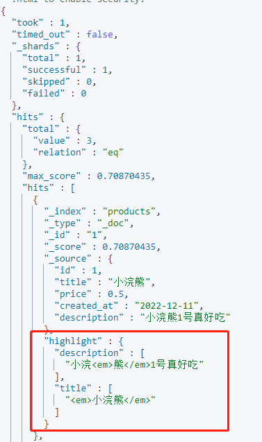

以上示例可以看到ES默认使用<em>标签将高亮内容进行了修饰，我们也可以进行标签的自定义

```
#使用pre_tags和post_tags自定义高亮HTML标签
GET /products/_search
{
  "query": {
    "bool": {
      "must": [
        {
          "term": {
            "title": {
              "value": "小浣熊"
            }
          }
        },{
          "term": {
            "description": {
              "value": "熊"
            }
          }
        }
      ]
    }
  }
  , "highlight": {
    "pre_tags": ["<span style='color:red'>"],
    "post_tags": ["</span>"], 
    "fields": {
      "description": {}
    }
  }
}
```

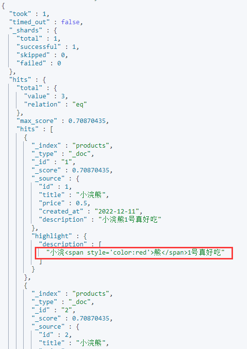

默认highlight中的分词字段只能是参与查询的字段，但是如果想让所有的字段都高亮显示，可以使用require_field_match开启多个字段高亮

```
GET /products/_search
{
  "query": {
     "term": {
       "description": {
        "value": "熊"
       }
     }
   }, 
  "highlight": {
    "pre_tags": ["<span style='color:red'>"],
    "post_tags": ["</span>"], 
    "require_field_match": "false", 
    "fields": {
      "*": {}
    }
  }
}
这样所有的字段都可以进行高亮显示，但是ES7中只有分词的字段类型才能够参与高亮显示。
例如，我们新建一个索引，此时description1，description2都是text类型，都是分词的
PUT /orders
{
  "settings": {
    "number_of_shards": 1,
    "number_of_replicas": 0
  },
  "mappings": {
    "properties": {
      "id":{
        "type": "integer"
      },
      "title":{
        "type": "keyword"
      },
      "description1":{
        "type": "text"
      },
      "description2":{
        "type": "text"
      }
    }
  }
}
然后我们插入一条数据
POST /orders/_doc/1
{
  "id":1,
  "title":"订单1",
  "description1":"订单1description11",
  "description2":"订单1description12"
}
我们进行查询时高亮显示，让多个字段都高亮显示
GET /orders/_search
{
  "query": {
          "term": {
            "description1": {
              "value": "单"
            }
          }
        }, 
  "highlight": {
    "pre_tags": ["<span style='color:red'>"],
    "post_tags": ["</span>"], 
    "require_field_match": "false", 
    "fields": {
      "*": {}
    }
  }
}
```

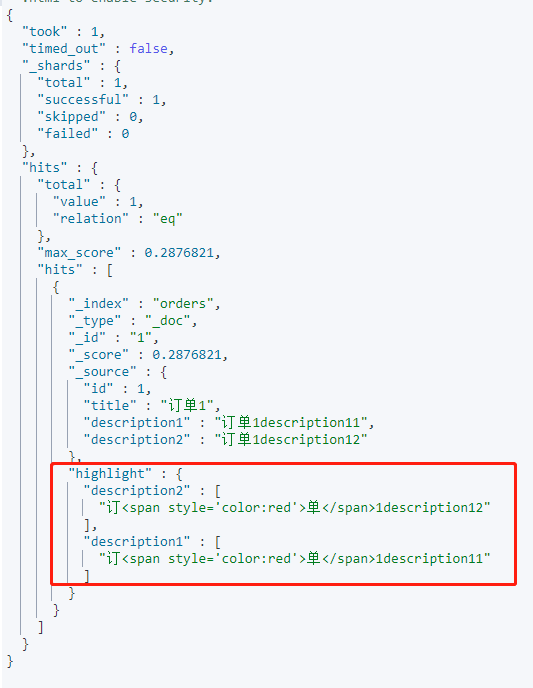

#### 返回指定条数[size]

指定查询结果中返回指定条数，默认返回值是10条

```
#指定返回两条数据，类似于mysql中的每页返回条数
GET /products/_search
{
  "query": {
    "match_all": {}
  },
  "size": 2
}
```

#### 分页查询[from]

用来指定起始返回位置，和**size**关键字连用可以实现分页效果

```
#从第0条开始，返回两条数据
GET /products/_search
{
  "query": {
    "match_all": {}
  },
  "from": 0, 	#这里数值的计算和mysql一样。（当前页-1）*size
  "size": 2
}
```

#### 指定字段排序[sort]

```
#以价格进行排序
GET /products/_search
{
  "query": {
    "match_all": {}
  },
  "from": 0, 
  "size": 10,
  "sort": [
    {
      "price": {
        "order": "desc"	#升序asc
      }
    }
  ]
}
```

我们手动指定排序的时候，会干预默认ES的搜索，所以我们查询出来的所有文档得分都不存在

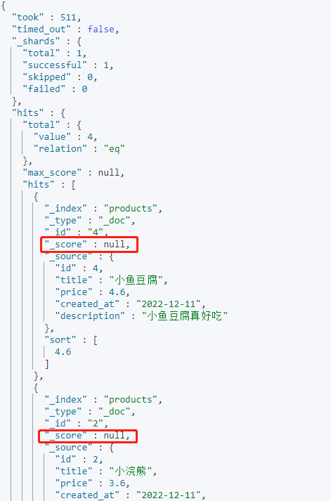

#### 返回指定字段[_source]

是一个数组，在数组中指定展示哪些字段，默认ES会返回所有的字段

```
#查询出来的结果只显示"title","description"两个字段
GET /products/_search
{
  "query": {
    "match_all": {}
  },
  "_source": ["title","description"]
}
```

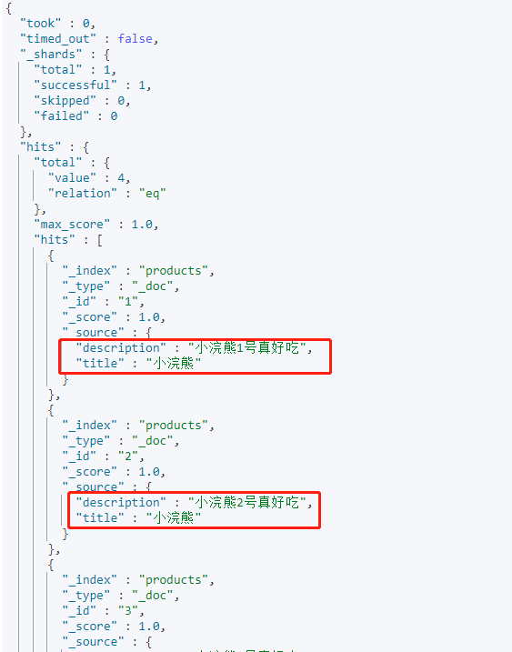

## 索引原理

### 倒排索引


### 索引模型

我们先创建一个索引及映射，现有索引和映射如下

```
PUT /products1
{
  "mappings": {
    "properties": {
      "description":{
        "type": "text"
      },
      "price":{
        "type": "float"
      },
      "title":{
        "type": "keyword"
      }
    }
  }
}
```

插入如下数据

| _id  | title        | price | description        |
| ---- | ------------ | ----- | ------------------ |
| 1    | 蓝月亮洗衣液 | 19.9  | 蓝月亮洗衣液很高效 |
| 2    | iphone13     | 19.9  | 很不错的手机       |
| 3    | 小浣熊干脆面 | 1.5   | 小浣熊很好吃       |

```
#使用批量添加的方式
PUT /products1/_doc/_bulk
{"index":{"_id":1}}
  {"title":"蓝月亮洗衣液","price":19.9,"description":"蓝月亮洗衣液很高效"}
{"index":{"_id":2}}
  {"title":"iphone13","price":19.9,"description":"很不错的手机"}
{"index":{"_id":3}}
  {"title":"小浣熊干脆面","price":1.5,"description":"小浣熊很好吃"}
```

在存储以上这些数据的时候，ES内部是这样实现的：

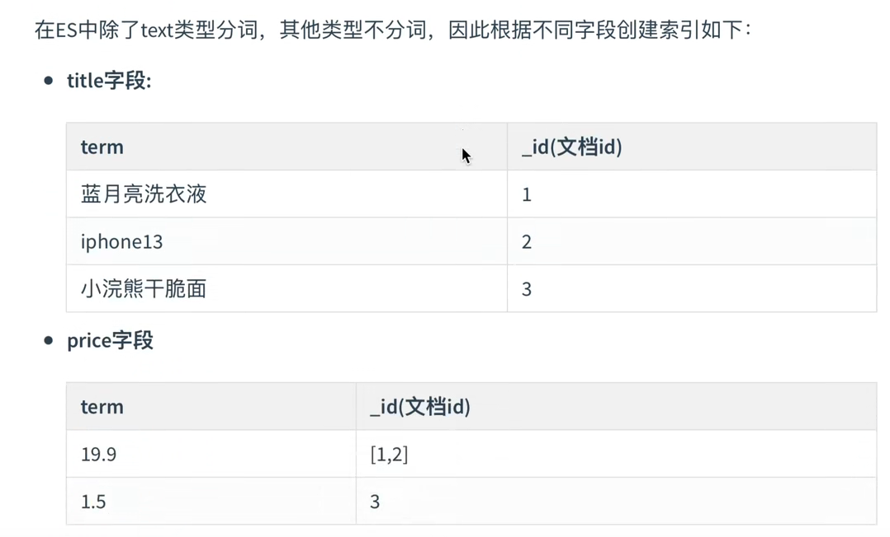

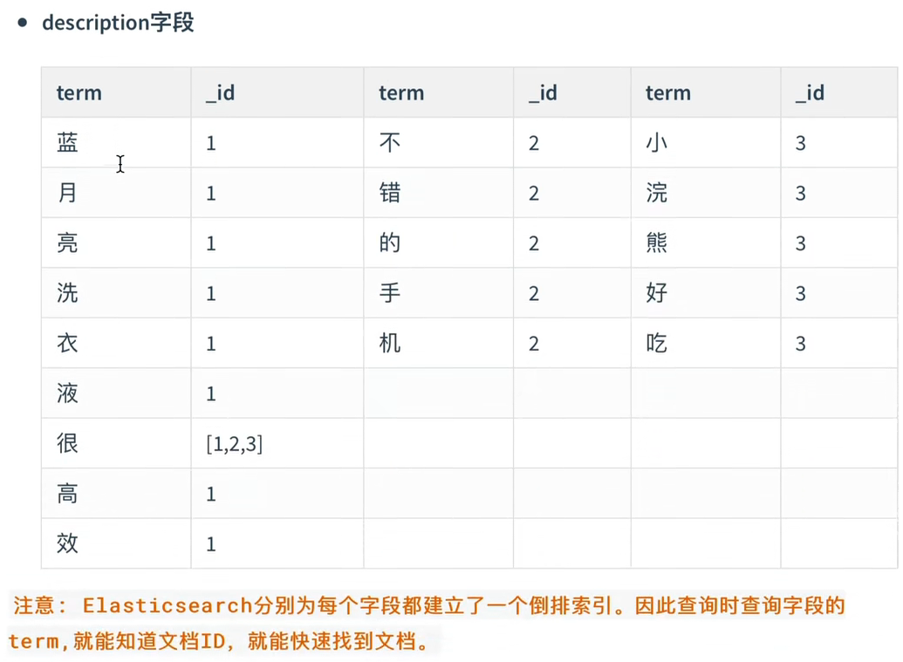

综合以上用图例表示为：

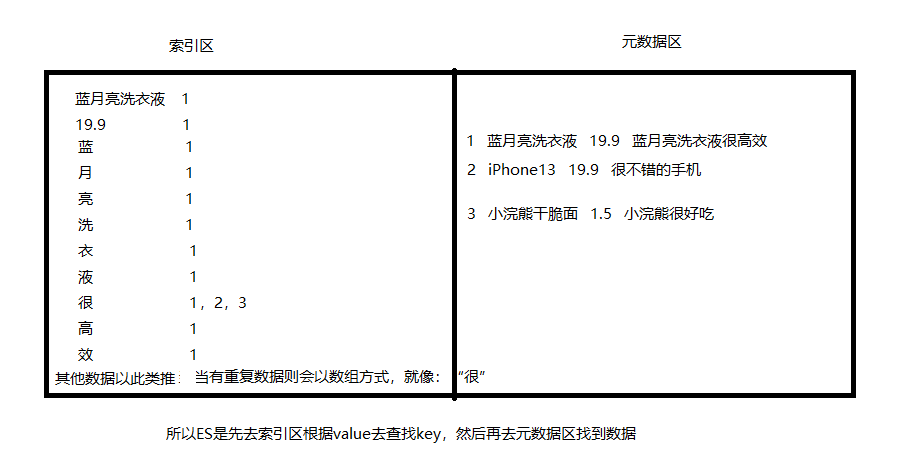

除此以外，ES不光会记录文档的id，还会值在文档中出现的次数以及文档的长度，用于计算出_score的值用作排序，比如以上的”很“字在三条文档中都会出现，那么ES中会做如下记录：

| id   | 出现次数 | 文档长度 |
| ---- | -------- | -------- |
| 1    | 1        | 10       |
| 2    | 1        | 6        |
| 3    | 1        | 6        |

可以看出ID为2和3的文档权值应该是相同的，ID为1的权限较低一点（10个长度才出现1次，所以值会低一点），所以在查询“很”字时，ES会默认将ID为2和3的显示在前面

```
 GET /products1/_search
  {
    "query": {
      "term": {
        "description": {
          "value": "很"
        }
      }
    }
  }
```

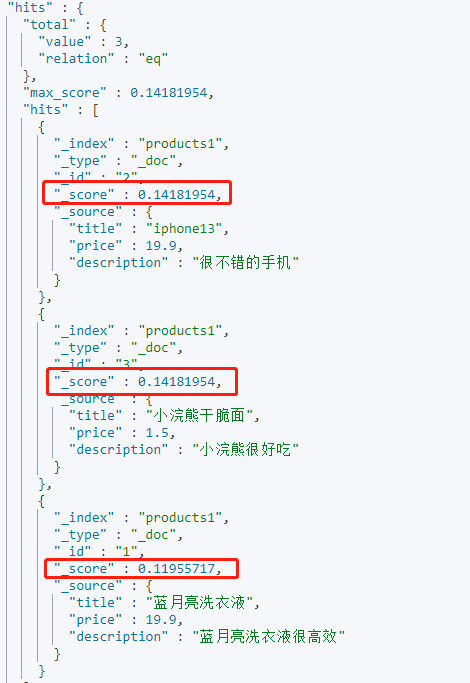

## 分词器

### Analysis和Analyzer


### Analyzer组成

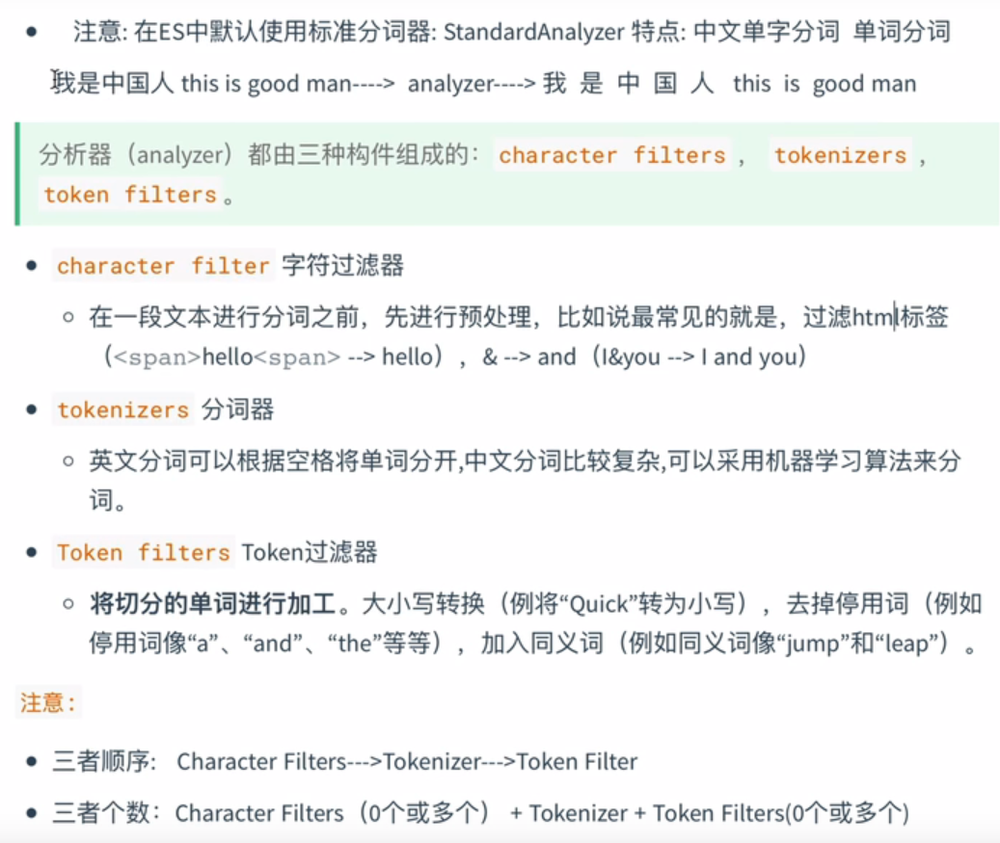

### 内置分词器

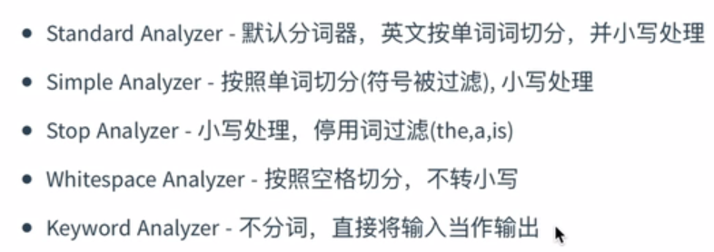

### 内置分词器测试

#### 标准分词器

特点：按照单词分词，英文统一转为小写，过滤标点符号，中文单字分词

```json
POST /_analyze
{
  "analyzer": "standard",
  "text": "this is a , good Man 中华人民共和国"
}
```

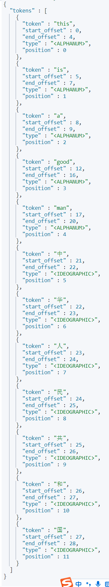

#### Simple分词器

特点：英文按照单词分词，英文统一转为小写，去掉标点符号，中文按照空格进行分词

```
POST /_analyze
{
  "analyzer": "simple",
  "text": "this is a , good Man 中华人民 共和国"
}
```

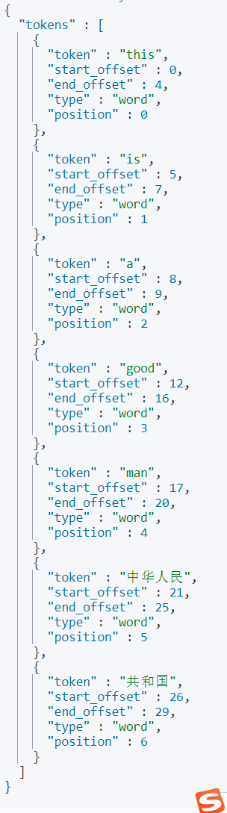

#### Whitespace分词器

特点：中文、英文按照空格进行分词，英文不会转成小写，不去掉标点符号

```
POST /_analyze
{
  "analyzer": "whitespace",
  "text": "this is a , good Man 中华人民 共和国"
}
```

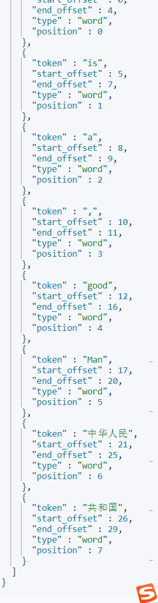

### 创建索引设置分词

```
PUT test1
{
  "mappings": {
    "properties": {
      "title":{
        "type": "text",
        "analyzer": "keyword"	#指定使用何种分词器
      }
    }
  }
}

添加一条记录
PUT /test1/_doc/1
{
  "title":"小黑，is good man!"
}

查询：因为指定了分词器是keyword，会将输入的内容当做一整个词语，不会进行分割，所以需要这样才能查询到
GET /test1/_search
{
  "query": {
    "term": {
      "title": {
        "value": "小黑，is good man!"	#因为不会分割，所以需要搜索输入的整个内容
      }
    }
  }
}
```

### 中文分词器

在ES中支持的中文分词器非常多，比如smartCN、IK等，推荐使用IK分词器

#### 安装IK分词器

开源分词器IK的GitHub：https://github.com/medcl/elasticsearch-analysis-ik

需要注意的是：

+ IK分词器的版本要与你安装的ES版本保持一致。这里使用的是7.14.0

1、下载对应版本

最好新建一个文件夹，比如ik，然后在文件夹中进行下载解压

```
wget https://github.com/medcl/elasticsearch-analysis-ik/releases/download/v7.14.0/elasticsearch-analysis-ik-7.14.0.zip
```

2、解压

解压zip文件，需要先安装unzip

yum install -y unzip

```
unzip elasticsearch-analysis-ik-7.14.0.zip 
```

3、移动到es安装目录中的plugins目录中

```
mv 要移动的文件夹 移动到那个位置(路径要根据自己现在的位置改变)
mv ik ./plugins/
```

ik分词器中包含的文件

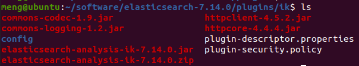

4、重启ES生效

5、本地安装IK分词器配置目录为：

```
ES安装目录/plugins/ik/config/IKAnalyzer.cfg.xml
```

#### IK使用


```
#ik_smart 最粗粒度的拆分
POST /_analyze
{
  "analyzer": "ik_smart",
  "text": "中华人民共和国国歌"
}
```

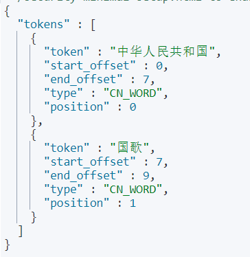

```
#ik_max_word 最细粒度的拆分
POST /_analyze
{
  "analyzer": "ik_max_word",
  "text": "中华人民共和国国歌"
}
```

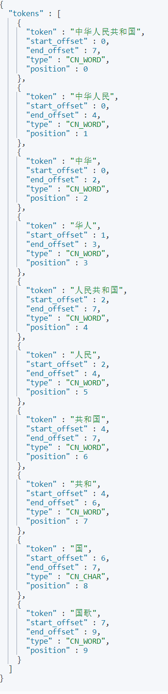

以后在创建索引时，如何指定ik分词器呢？

和上面一样

```
PUT test2
{
  "mappings": {
    "properties": {
      "title":{
        "type": "text",
        "analyzer": "ik_max_word"	#指定使用何种分词器
      }
    }
  }
}
```

#### 拓展词、停用词配置


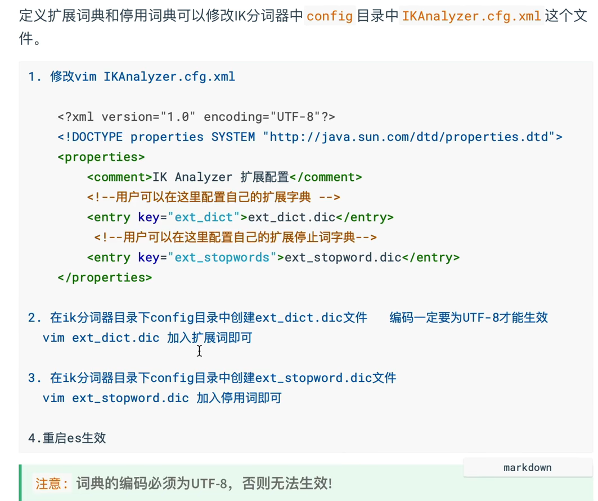

例如：

```
POST /_analyze
{
  "analyzer": "ik_max_word",
  "text": "大家好，我叫小明明"
}

此时默认是没有“小明明”、“我叫”这两个词组的
```

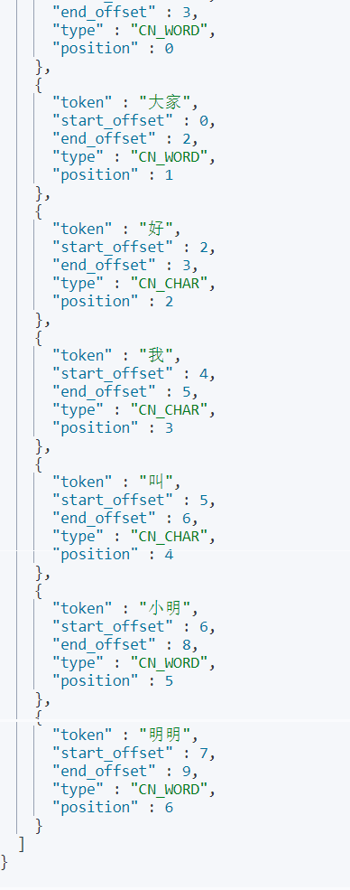

可以通过设置拓展词加入，注意：每行只能写一个词

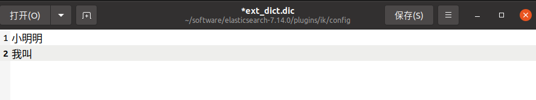

```
POST /_analyze
{
  "analyzer": "ik_max_word",
  "text": "大家好，我叫小明明"
}

再次测试发现，拓展词加入了
```


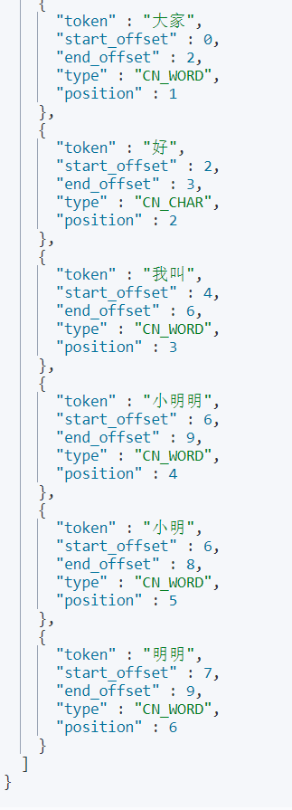

停用词正好相反，可以让本该出现的词不出现，比如将上面例子中的“明明”停用

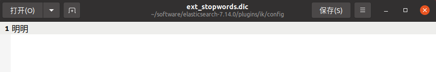日常使用中可以停用的词和拓展的词都会很多，如果自己一个个加入会很麻烦，所以IK分词器默认给我们建立了很多的默认词典。我们可以在他的基础上在进行修改即可

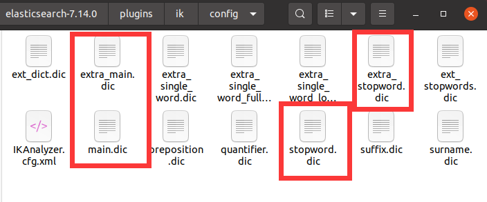

## 过滤查询<Filter Query>

### 过滤查询

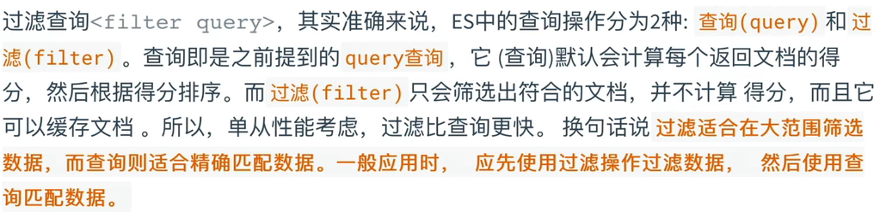


### 使用

```
# 要配合着bool查询来使用
GET /products1/_search
{
  "query": {
    "bool": {
      "must": [
        {"match_all": {}}	#查询条件
      ],
      "filter": {}	#过滤条件
    }
  }
}
```

注意：

+ 在执行 filter 和 query 时，先执行filter，再执行query
+ Elasticsearch会自动缓存经常使用的过滤器，以加快性能

### 类型

常见的过滤类型有：term、terms、range、exists、ids等filter

为了做示例我们先创建一个索引

```JSON
# 创建索引及映射
PUT /products1
{
  "mappings": {
    "properties": {
      "description":{
        "type": "text",
        "analyzer": "ik_max_word"	#指定成ik分词器的一种方式
      },
      "price":{
        "type": "float"
      },
      "title":{
        "type": "keyword"
      }
    }
  }
}

#添加数据，采用批量添加的方式
PUT /products1/_doc/_bulk
{"index":{"_id":1}}
  {"title":"蓝月亮洗衣液","price":19.9,"description":"蓝月亮洗衣液很高效"}
{"index":{"_id":2}}
  {"title":"iphone13","price":19.9,"description":"很不错的手机"}
{"index":{"_id":3}}
  {"title":"小浣熊干脆面","price":1.5,"description":"小浣熊很好吃"}
{"index":{"_id":4}}
  {"title":"辣条","price":1.5,"description":"辣条很好吃"}
{"index":{"_id":5}}
  {"title":"大饼","price":1.5,"description":"大饼很好吃"}
```

#### term过滤

```
# term过滤
#先过滤出来description有“好吃”的，然后再过滤的基础上查询所有，所以会将description字段中有“好吃”的全部查询出来
GET /products1/_search
{
  "query": {
    "bool": {
      "must": [
        {
          "match_all": {}
        }
      ],
      "filter": [
        {
          "term": {
            "description": "好吃"
          }
        }
      ]
    }
  }
}
```

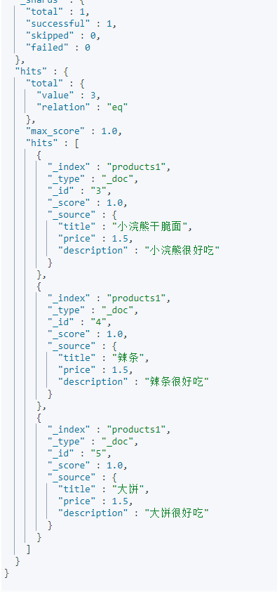

```
#term过滤
#先过滤出来description有“好吃”的，然后再过滤的基础上查询description有"浣熊"的，所以会将description字段中有“好吃””浣熊“的查询出来
GET /products1/_search
{
  "query": {
    "bool": {
      "must": [
        {
          "term": {
            "description": {
              "value": "浣熊"
            }
          }
        }
      ],
      "filter": [
        {
          "term": {
            "description": "好吃"
          }
        }
      ]
    }
  }
}
```

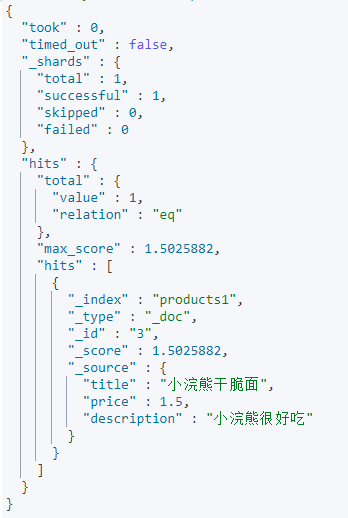

#### terms过滤

```
#terms过滤，先过滤出description字段中包含"浣熊","洗衣液","辣条"的，在此基础上查询所有
需要注意，使用IK分词器，像"洗衣液","辣条"需要拓展才能查询到
GET /products1/_search
{
  "query": {
    "bool": {
      "must": [
        {
          "match_all": {}
        }
      ],
      "filter": [
        {
          "terms": {
            "description": [
              "浣熊",
              "洗衣液",
              "辣条"
            ]
          }
        }
      ]
    }
  }
}
```

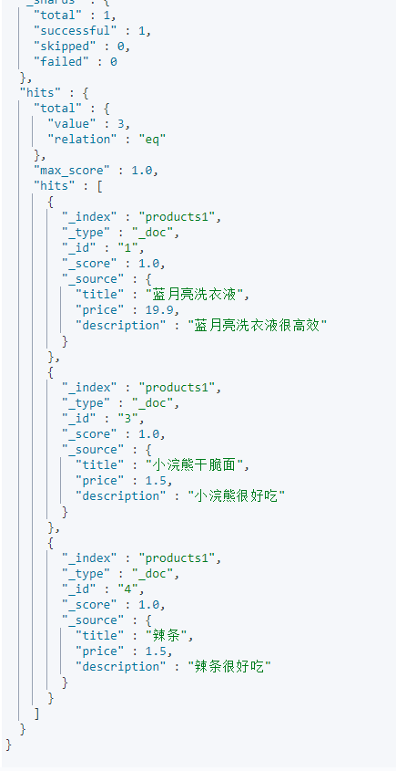

#### range 过滤

```
# range过滤，先过滤出0<=price<=10的，然后在这个基础上，查询description包含辣条的
GET /products1/_search
{
  "query": {
    "bool": {
      "must": [
        {
          "term": {
            "description": {
              "value": "辣条"
            }
          }
        }
      ],
      "filter": [
        {
          "range": {
            "price": {
              "gte": 0,
              "lte": 10
            }
          }
        }
      ]
    }
  }
}
```

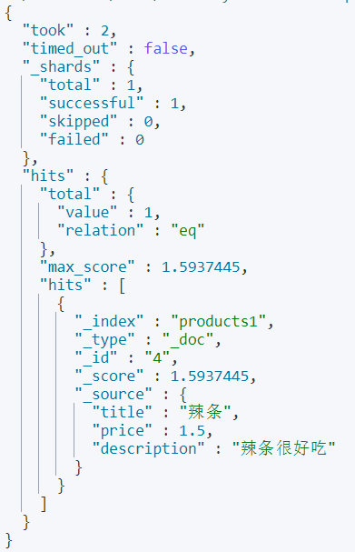

#### exists 过滤

过滤存在指定字段的记录，获取指定字段不为空的索引记录

```
# range过滤，先过滤出存在“description”字段的记录，然后查询出“description”中包含“辣条”的
GET /products1/_search
{
  "query": {
    "bool": {
      "must": [
        {
          "term": {
            "description": {
              "value": "辣条"
            }
          }
        }
      ],
      "filter": [
        {
          "exists": {
            "field": "description"
            #"field": "aaa" 如果这边指定一个不存在的字段，比如“aaa”,那么将过滤不出记录
          }
        }
      ]
    }
  }
}
```

#### ids 过滤

过滤含有指定id的记录

```
# ids过滤，先过滤出id为1、2、3的，然后在此基础上查询“description”字段中包含“洗衣液”的
GET /products1/_search
{
  "query": {
    "bool": {
      "must": [
        {
            "term": {
              "description": {
                "value": "洗衣液"
              }
            }         
          }
      ],
      "filter": [
        {
          "ids": {
            "values": [
              "1",
              "2",
              "3"
            ]
          }
        }
      ]
    }
  }
}
```

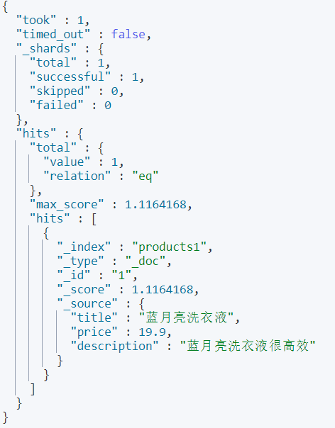

## 整合应用

### 引入依赖

```xml
<dependency>
    <groupId>org.springframework.boot</groupId>
    <artifactId>spring-boot-starter-data-elasticsearch</artifactId>
</dependency>
```

### 配置客户端

```java
import org.elasticsearch.client.RestHighLevelClient;
import org.springframework.context.annotation.Bean;
import org.springframework.context.annotation.Configuration;
import org.springframework.data.elasticsearch.client.ClientConfiguration;
import org.springframework.data.elasticsearch.client.RestClients;
import org.springframework.data.elasticsearch.config.AbstractElasticsearchConfiguration;

@Configuration
public class RestClientConfig extends AbstractElasticsearchConfiguration {

    @Override
    @Bean
    public RestHighLevelClient elasticsearchClient() {

        final ClientConfiguration clientConfiguration = ClientConfiguration.builder()
            //修改成ES服务的地址，当然这边的配置可以转移到配置文件里面
                .connectedTo("localhost:9200")
                .build();

        return RestClients.create(clientConfiguration).rest();
    }
}
```

### 客户端对象

我们通过以上的配置与ES建立连接之后，在Spring的工厂中会存在以下两个对象

+ ElasticSearchOperations
+ RestHighLevelClient      **推荐**

我们可以通过任意一个对象去操作ES，那么ElasticSearchOperations是通过对象的方式去操作ES ，RestHighLevelClient则是通过rest方式操作ES，和kibana中操作ES很像

#### ElasticSearchOperations

特点：始终使用面向对象的方式操作ES

##### 建立索引及映射

```java
/**
 * @Document 作用在类上，将这个类对象转为es中一条文档进行录入
 *      indexName：用来指定文档的索引名称
 *      createIndex：用来指定是否创建索引
 */
@Document(indexName = "products",createIndex = true)
public class Product {
    //@Id作用在属性上，将对象id字段与ES中文档的_id对应
    @Id	
    private Integer id;
  	/**@Field作用在属性上，用来描述属性在ES中存储类型以及分词情况
  	*	--type用来指定字段类型
   	*/
    @Field(type = FieldType.Keyword)
    private String title;
    @Field(type = FieldType.Double)
    private Double price;
    @Field(type = FieldType.Text)
    private String description;
    //生成set/get
}
```

##### 新增文档

通过ElasticsearchOperations的save方法

```java
@SpringBootTest
class DemoApplicationTests {
    @Autowired
    private ElasticsearchOperations elasticsearchOperations;
    @Test
    public void testInsert() {
        Product product = new Product();
        product.setId(1);
        product.setTitle("小浣熊干脆面");
        product.setPrice(1.5);
        product.setDescription("小浣熊干脆面很好吃");
        elasticsearchOperations.save(product);
    }
}

通过这种方式添加的文档会有_class字段，记录文档的类型，用于后面反序列化时，反序列化何种类型
```

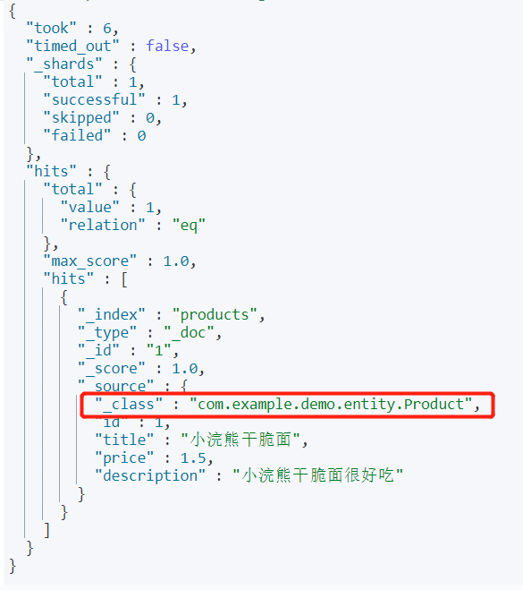

##### 更新文档

也是通过ElasticsearchOperations的save方法

```java
//save方法当文档id不存在时添加文档，当文档id存在时更新文档
@Test
public void testUpdate() {
    Product product = new Product();
    product.setId(1);
    product.setTitle("小浣熊");
    product.setPrice(1.5);
    product.setDescription("小浣熊干脆面很好吃");
    elasticsearchOperations.save(product);
}
```

##### 查询

```java
//查询一条文档
@Test
public void testQuery() {
    Product product = elasticsearchOperations.get("1", Product.class);
    System.out.println(product.getId()+product.getTitle());
}

//查询所有
@Test
public void testQueryAll() throws JsonProcessingException {
    SearchHits<Product> productSearchHits = elasticsearchOperations.search(Query.findAll(), Product.class);
    System.out.println("最高分数:"+productSearchHits.getMaxScore());
    System.out.println("总条数:"+productSearchHits.getTotalHits());
    for (SearchHit<Product> productSearchHit:productSearchHits){
        //将查询出来的内容转换成json格式
        System.out.println(new ObjectMapper().writeValueAsString(productSearchHit.getContent()));
    }
}
```

##### 删除文档

```java
//删除一条
@Test
public void testDelete() {
    Product product = new Product();
    product.setId(1);
    elasticsearchOperations.delete(product);
}

//删除所有
@Test
public void testDeleteAll() {
    elasticsearchOperations.delete(Query.findAll(),Product.class);
}
```

#### RestHighLevelClient

类似于在kibana中操作ES

##### 创建索引及映射

```java
/**
* 因为我们上面配置完成，和ES建立连接之后会自动生成ElasticSearchOperations和RestHighLevelClient两个对象，所以这里我们直接
*注入使用就可以
*/
@Autowired
private RestHighLevelClient restHighLevelClient;


//在kibana中
PUT products
{
  "mappings": {
    "properties": {
      "title":{
        "type": "keyword"
      },
      "price":{
        "type": "double"
      },
      "create_at":{
        "type": "date"
      },
      "description":{
        "type": "text",
        "analyzer": "ik_max_word"
      }
    }
  }
}


//在java中
@Test
public void testRestInsert() throws IOException {
    //指定创建索引的名称
    CreateIndexRequest createIndexRequest = new CreateIndexRequest("product");
    /**
    * 这里的索引结构可以直接从kibana中写好复制过来，
    * 当然如果只是创建索引及映射完全可以在kibana中操作,这里也是为了测试
    * mapping方法创建索引，参数1：指定映射的JSON结构    参数2：指定数据类型
    */
    createIndexRequest.mapping("{\n" +
    "    \"properties\": {\n" +
    "      \"title\":{\n" +
    "        \"type\": \"keyword\"\n" +
    "      },\n" +
    "      \"price\":{\n" +
    "        \"type\": \"double\"\n" +
    "      },\n" +
    "      \"create_at\":{\n" +
    "        \"type\": \"date\"\n" +
    "      },\n" +
    "      \"description\":{\n" +
    "        \"type\": \"text\",\n" +
    "        \"analyzer\": \"ik_max_word\"\n" +
    "      }\n" +
    "    }\n" +
    "  }", XContentType.JSON);
    //create方法，参数1：创建索引请求对象   参数2：请求配置对象
    CreateIndexResponse createIndexResponse = restHighLevelClient.indices().create(createIndexRequest, RequestOptions.DEFAULT);
    System.out.println("索引创建状态："+createIndexResponse.isAcknowledged());
    restHighLevelClient.close();
}
```

##### 删除索引

```java
//在kibana中
DELETE /products

//在java中
@Test
public void testRestDelete() throws IOException {
    DeleteIndexRequest deleteIndexRequest = new DeleteIndexRequest("product");
    AcknowledgedResponse delete = restHighLevelClient.indices().delete(deleteIndexRequest, RequestOptions.DEFAULT);
    System.out.println("删除状态：" + delete.isAcknowledged());
}
```

##### 创建文档

```java
//在kibana中
PUT /product/_doc/1
{
  "title":"小浣熊",
  "price":"1.5",
  "create_at":"2022-01-01",
  "description":"小浣熊很好吃"
}

//在java中
@Test
public void testRestInsertDoc() throws IOException {
    //指定操作那个索引
    IndexRequest indexRequest = new IndexRequest("product");
    indexRequest.id("1");//手动指定文档id，不指定会自动生成UUID形式的
    //source方法，参数1：索引请求对象   参数2：请求配置对象
    indexRequest.source("{\"tittle\":\"小浣熊\",\"price\":\"1.5\",\"create_at\":\"2022-01-01\",\"description\":\"小浣熊很好吃\"}",XContentType.JSON);
    IndexResponse indexResponse = restHighLevelClient.index(indexRequest, RequestOptions.DEFAULT);
    System.out.println("文档创建状态："+indexResponse.status());
}
```

##### 更新文档

```java
//在kibana中
POST /product/_doc/1/_update
{
  "doc":{
    "title":"小浣熊干脆面"
  }
}

//在java中
@Test
public void testRestUpdateDoc() throws IOException {
    UpdateRequest updateRequest = new UpdateRequest("product","1");
    updateRequest.doc("{\"title\":\"小浣熊干脆面\"}",XContentType.JSON);
    UpdateResponse updateResponse = restHighLevelClient.update(updateRequest, RequestOptions.DEFAULT);
    System.out.println("更新文档状态:"+updateResponse.status());
}
```

##### 删除文档

```java 
//在kibana中
DELETE /product/_doc/1

//在java中
@Test
public void testRestDeleteDoc() throws IOException {
    DeleteRequest deleteRequest = new DeleteRequest("product", "1");
    DeleteResponse deleteResponse = restHighLevelClient.delete(deleteRequest, RequestOptions.DEFAULT);
    System.out.println("删除文档状态："+deleteResponse.status());
}
```

##### 基于ID查询文档

```java
//在kibana中
GET /product/_doc/1

//在java中
@Test
public void testRestFindByIdDoc() throws IOException {
    GetRequest getRequest = new GetRequest("product", "1");
    GetResponse getResponse = restHighLevelClient.get(getRequest, RequestOptions.DEFAULT);
    System.out.println("id:"+getResponse.getId());
    System.out.println("source的String形式:"+getResponse.getSourceAsString());
    Map<String, Object> source = getResponse.getSource();
    System.out.println(source.get("title"));
}
```

##### 查询所有

```java
//在kibana中
GET /product/_search
{
  "query": {
    "match_all": {}
  }
}

//在java中
@Test
public void testMatchAll() throws IOException {
    SearchRequest searchRequest = new SearchRequest("product");//指定搜索的索引
    SearchSourceBuilder searchSourceBuilder = new SearchSourceBuilder();
    searchSourceBuilder.query(QueryBuilders.matchAllQuery());//查询所有
    searchRequest.source(searchSourceBuilder);//指定查询条件

    //这里返回的响应对象就是对下面图片中结果的封装，取值的时候可以对照着下面图片
    SearchResponse searchResponse = restHighLevelClient.search(searchRequest, RequestOptions.DEFAULT);

    System.out.println("总条数："+searchResponse.getHits().getTotalHits().value);
    System.out.println("最大得分："+searchResponse.getHits().getMaxScore());

    //这块取值可以对照着下面的图片，在返回结果中有一个hits数组，hits数组中还有一个hits数组，在下面才是每一个hit对象
    SearchHit[] hits = searchResponse.getHits().getHits();

    for(SearchHit hit:hits) {
        System.out.println("id: "+hit.getId()+"   source:"+hit.getSourceAsString());
    }
}
```

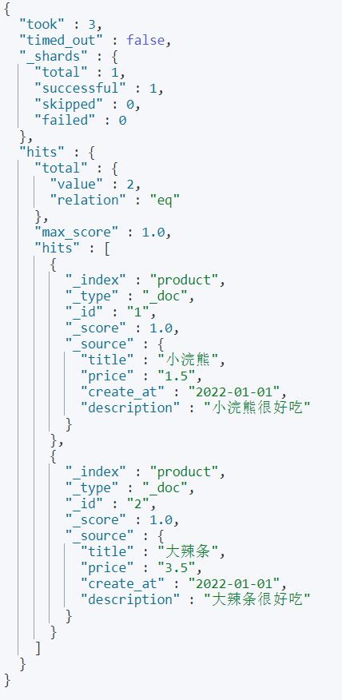

##### term查询

```java
@Test
public void testTerm() throws IOException {
    SearchRequest searchRequest = new SearchRequest("product");
    SearchSourceBuilder searchSourceBuilder = new SearchSourceBuilder();
    //和上面的查询相比，只需要更换查询条件，其他不需要变
    searchSourceBuilder.query(QueryBuilders.termQuery("description","浣熊"));
    
    searchRequest.source(searchSourceBuilder);

    SearchResponse searchResponse = restHighLevelClient.search(searchRequest, RequestOptions.DEFAULT);

    System.out.println("总条数："+searchResponse.getHits().getTotalHits().value);
    System.out.println("最大得分："+searchResponse.getHits().getMaxScore());

    SearchHit[] hits = searchResponse.getHits().getHits();

    for(SearchHit hit:hits) {
        System.out.println("id: "+hit.getId()+"   source:"+hit.getSourceAsString());
    }
}
```

经过以上两个查询，可以发现只有查询条件不同，其他代码都相同，那么我们可以抽象出一个方法

```java
//抽象出一个方法，将查询条件作为参数传递
public void query(QueryBuilder queryBuilder) throws IOException {
    SearchRequest searchRequest = new SearchRequest("product");//指定搜索的索引
    SearchSourceBuilder searchSourceBuilder = new SearchSourceBuilder();
    searchSourceBuilder.query(queryBuilder);//查询所有
    searchRequest.source(searchSourceBuilder);//指定查询条件

    SearchResponse searchResponse = restHighLevelClient.search(searchRequest, RequestOptions.DEFAULT);

    System.out.println("总条数："+searchResponse.getHits().getTotalHits().value);
    System.out.println("最大得分："+searchResponse.getHits().getMaxScore());

    SearchHit[] hits = searchResponse.getHits().getHits();

    for(SearchHit hit:hits) {
        System.out.println("id: "+hit.getId()+"   source:"+hit.getSourceAsString());
    }
}
```

这样抽象出方法后，以后所有的参数查询都可以借助这个方法

```java
@Test
public void testQuery() throws IOException {
    //1、查询所有
    //query(QueryBuilders.matchAllQuery());
    //2、term 关键词查询
    //query(QueryBuilders.termQuery("description","辣条"));
    //3、range 范围查询 1<price<=3
    //query(QueryBuilders.rangeQuery("price").gt(1).lte(3));
    //4、prefix 前缀查询
    //query(QueryBuilders.prefixQuery("title","小浣熊"));
    //5、wildcard 通配符查询 ？代表一个字符 *代表任意多个字符
    //query(QueryBuilders.wildcardQuery("title","小*"));
    //6、ids 多个指定id查询
    //query(QueryBuilders.idsQuery().addIds("1","2","3"));
    //或者可以这样写
    //query(QueryBuilders.idsQuery().addIds("1").addIds("2").addIds("3"));
    //7、multi_match 多字段查询
    query(QueryBuilders.multiMatchQuery("非常好吃小浣熊","title","description"));
}
```

##### 分页查询

```java
//在kibana中，from指定从第几页开始，size指每页显示条数
GET /product/_search
{
  "query": {
    "match_all": {}
  },
  "from": 0,
  "size": 1
}

//在java中 from size
@Test
public void testSearch() throws IOException {
    SearchRequest searchRequest = new SearchRequest("product");
    SearchSourceBuilder sourceBuilder = new SearchSourceBuilder();
    sourceBuilder.query(QueryBuilders.matchAllQuery());
    sourceBuilder.from(0);//起始位置
    sourceBuilder.size(1);//每页显示条数
    //也可以链式调用
    //        sourceBuilder.query(QueryBuilders.matchAllQuery()).from(0).size(1);
    searchRequest.source(sourceBuilder);
    SearchResponse searchResponse = restHighLevelClient.search(searchRequest, RequestOptions.DEFAULT);
    System.out.println("总条数："+searchResponse.getHits().getTotalHits().value);
    System.out.println("最大得分："+searchResponse.getHits().getMaxScore());

    SearchHit[] hits = searchResponse.getHits().getHits();

    for(SearchHit hit:hits) {
        System.out.println("id: "+hit.getId()+"   source:"+hit.getSourceAsString());
    }
}
```

##### 排序

```java
//在kibana中，使用sort实现，这里在上个分页例子的基础上排序
GET /product/_search
{
  "query": {
    "match_all": {}
  },
  "from": 0,
  "size": 10,
  "sort": [
    {
      "price": {
        "order": "asc"
      }
    }
  ]
}

//在java中，sort
@Test
public void testSearch() throws IOException {
    SearchRequest searchRequest = new SearchRequest("product");
    SearchSourceBuilder sourceBuilder = new SearchSourceBuilder();
    sourceBuilder.query(QueryBuilders.matchAllQuery());
    sourceBuilder.from(0);//起始位置
    sourceBuilder.size(10);//每页显示条数
    sourceBuilder.sort("price", SortOrder.ASC);//排序，参数1：按哪个字段排序 参数2：排序方式
    //        也可以链式调用
    //        sourceBuilder.query(QueryBuilders.matchAllQuery()).from(0).size(10).sort("price", SortOrder.ASC);
    searchRequest.source(sourceBuilder);
    SearchResponse searchResponse = restHighLevelClient.search(searchRequest, RequestOptions.DEFAULT);
    System.out.println("总条数："+searchResponse.getHits().getTotalHits().value);
    System.out.println("最大得分："+searchResponse.getHits().getMaxScore());

    SearchHit[] hits = searchResponse.getHits().getHits();

    for(SearchHit hit:hits) {
        System.out.println("id: "+hit.getId()+"   source:"+hit.getSourceAsString());
    }
}
```

##### 显示指定字段

```java
//在kibana中，使用_source实现，这里在上个例子的基础上实现
GET /product/_search
{
  "query": {
    "match_all": {}
  },
  "from": 0,
  "size": 10,
  "sort": [
    {
      "price": {
        "order": "asc"
      }
    }
  ],
  "_source": ["title","description"]
}

//在java中 fetchSource
@Test
public void testSearch() throws IOException {
    SearchRequest searchRequest = new SearchRequest("product");
    SearchSourceBuilder sourceBuilder = new SearchSourceBuilder();
    sourceBuilder.query(QueryBuilders.matchAllQuery());
    sourceBuilder.from(0);//起始位置
    sourceBuilder.size(10);//每页显示条数
    //排序，参数1：按哪个字段排序 参数2：排序方式
    sourceBuilder.sort("price", SortOrder.ASC);
    //fetchSource 参数1：指定显示字段数组  参数2：指定排除字段数组
    //        sourceBuilder.fetchSource(new String[]{"title","description"},new String[]{});//只显示title、description两个字段
    sourceBuilder.fetchSource(new String[]{},new String[]{"create_at"});//不显示create_at字段
    //        也可以链式调用
    //        sourceBuilder.query(QueryBuilders.matchAllQuery())
    //                .from(0)
    //                .size(10)
    //                .sort("price", SortOrder.ASC)
    //                .fetchSource(new String[]{},new String[]{"create_at"});
    searchRequest.source(sourceBuilder);
    SearchResponse searchResponse = restHighLevelClient.search(searchRequest, RequestOptions.DEFAULT);
    System.out.println("总条数："+searchResponse.getHits().getTotalHits().value);
    System.out.println("最大得分："+searchResponse.getHits().getMaxScore());

    SearchHit[] hits = searchResponse.getHits().getHits();

    for(SearchHit hit:hits) {
        System.out.println("id: "+hit.getId()+"   source:"+hit.getSourceAsString());
    }
}
```

##### 高亮显示

```java
//这里我们重新创建索引，并将title字段设置成分词类型的text
//删除索引
DELETE /product
//重新创建    
PUT product
{
  "mappings": {
    "properties": {
      "title":{
        "type": "text",
        "analyzer": "ik_max_word"
      },
      "price":{
        "type": "double"
      },
      "create_at":{
        "type": "date"
      },
      "description":{
        "type": "text",
        "analyzer": "ik_max_word"
      }
    }
  }
}
//插入数据
PUT /product/_doc/1
{
  "title":"小浣熊",
  "price":"1.5",
  "create_at":"2022-01-01",
  "description":"小浣熊很好吃"
}
PUT /product/_doc/2
{
  "title":"豆腐",
  "price":"3.5",
  "create_at":"2022-01-01",
  "description":"豆腐很好吃"
}

PUT /product/_doc/3
{
  "title":"辣条",
  "price":"2.5",
  "create_at":"2022-01-01",
  "description":"辣条很好吃"
}


//在kibana中使用highlight指定
GET /product/_search
{
  "query": {
    "term": {
      "description": {
        "value": "好吃"
      }
    }
  },
  "from": 0,
  "size": 10,
  "sort": [
    {
      "price": {
        "order": "asc"
      }
    }
  ],
  "highlight": {
    "require_field_match": "false",
    "pre_tags": ["<span style='color:red'>"],
    "post_tags": ["</span>"],
    "fields": {"description": {},"title": {}}
  }
}

//在java中 highlighter
@Test
public void testSearch() throws IOException {
    SearchRequest searchRequest = new SearchRequest("product");
    SearchSourceBuilder sourceBuilder = new SearchSourceBuilder();

    //高亮条件的构造
    HighlightBuilder highlightBuilder = new HighlightBuilder();
    highlightBuilder.requireFieldMatch(false).field("title").field("description").preTags("<span style='color:red;'>").postTags("</span>");
    
    sourceBuilder.query(QueryBuilders.termQuery("description","豆腐"));
    sourceBuilder.from(0);//起始位置
    sourceBuilder.size(10);//每页显示条数
    sourceBuilder.sort("price", SortOrder.ASC);//排序，参数1：按哪个字段排序 参数2：排序方式
    sourceBuilder.fetchSource(new String[]{},new String[]{"create_at"});//不显示create_at字段

    sourceBuilder.highlighter(highlightBuilder);
    searchRequest.source(sourceBuilder);
    SearchResponse searchResponse = restHighLevelClient.search(searchRequest, RequestOptions.DEFAULT);
    System.out.println("总条数："+searchResponse.getHits().getTotalHits().value);
    System.out.println("最大得分："+searchResponse.getHits().getMaxScore());

    SearchHit[] hits = searchResponse.getHits().getHits();

    for(SearchHit hit:hits) {
        System.out.println("id: "+hit.getId()+"   source:"+hit.getSourceAsString());
        //在取得高亮的显示时，可以对照下图的JSON结构
        Map<String, HighlightField> highlightFields = hit.getHighlightFields();
        if(highlightFields.containsKey("description")) {
            System.out.println("description高亮结果："+highlightFields.get("description").fragments()[0]);
        }
        if(highlightFields.containsKey("title")) {
            System.out.println("title高亮结果："+highlightFields.get("title").fragments()[0]);
        }
    }
}
```

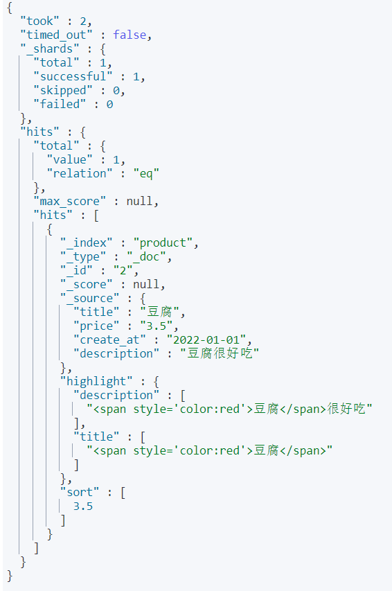

##### 过滤查询

ES中的查询分为两种，query和filter query

query：精确查询，查询并计算文档的得分，并根据文档得分进行返回

filter query：过滤查询，用来在大量的数据中筛选出符合条件的数据，不会计算文档的得分，对于一些经常使用的filter query会对结果进行缓存

注意：一旦使用了query和filter query，那么ES会优先执行filter query，在过滤的基础上再执行query

```java 
@Test
public void filterQuery() throws IOException {
    SearchRequest searchRequest = new SearchRequest("product");
    SearchSourceBuilder sourceBuilder = new SearchSourceBuilder();
    sourceBuilder.query(QueryBuilders.matchAllQuery());//在过滤的基础上再查询所有
    //sourceBuilder.query(QueryBuilders.termQuery("description","浣熊"));//在过滤的基础上再查询出description中包含“浣熊”的
    //指定过滤条件
    //sourceBuilder.postFilter(QueryBuilders.termQuery("description","豆腐"));//过滤description字段中包含“豆腐”字段的
    //sourceBuilder.postFilter(QueryBuilders.rangeQuery("price").gt(0).lte(3));//过滤出0<price<=3的
    //sourceBuilder.postFilter((QueryBuilders.existsQuery("title")));//过滤出存在title字段的
    sourceBuilder.postFilter(QueryBuilders.idsQuery().addIds("1","2","3"));//过滤出ID为1、2、3的
    //searchRequest.source(sourceBuilder);
    SearchResponse searchResponse = restHighLevelClient.search(searchRequest, RequestOptions.DEFAULT);

    System.out.println("总条数："+searchResponse.getHits().getTotalHits().value);
    System.out.println("最大得分："+searchResponse.getHits().getMaxScore());

    SearchHit[] hits = searchResponse.getHits().getHits();

    for(SearchHit hit:hits) {
        System.out.println("id: "+hit.getId()+"   source:"+hit.getSourceAsString());
    }
}		
```

##### restHighLevelClient操作对象

新建一个索引

```json
PUT /goods
{
  "mappings": {
    "properties": {
      "id":{
        "type": "integer"
      },
      "title":{
        "type": "keyword"
      },
      "price":{
        "type": "double"
      },
      "description":{
        "type": "text",
        "analyzer": "ik_max_word"
      }
    }
  }
}
```

创建相关的实体类

```java
public class Goods {
    private Integer id;
    private String title;
    private Double price;
    private String description;
    //生成set/get以及toString
}
```

操作

```java
@SpringBootTest
public class DemoGoods {
    @Autowired
    private RestHighLevelClient restHighLevelClient;

    //插入数据
    @Test
    public void testInsert() throws IOException {
        Goods goods = new Goods();
        goods.setId(1);
        goods.setTitle("小浣熊干脆面");
        goods.setPrice(1.5);
        goods.setDescription("小浣熊干脆面很好吃");

        IndexRequest indexRequest = new IndexRequest("goods");
        indexRequest.id(goods.getId().toString());
        //这里通过jackson下面的ObjectMapper对象将对象转换成json
       	//这里我们原先直接传递的JSON串，这里可以将对象转成JSON串后传入，便于我们直接操作对象
        indexRequest.source(new ObjectMapper().writeValueAsString(goods), XContentType.JSON);
        IndexResponse indexResponse = restHighLevelClient.index(indexRequest, RequestOptions.DEFAULT);

        System.out.println(indexResponse.status());
    }
    
    
    //查询操作
    @Test
    public void testQuery() throws IOException {
        SearchRequest searchRequest = new SearchRequest("goods");
        SearchSourceBuilder searchSourceBuilder = new SearchSourceBuilder();
        searchSourceBuilder.query(QueryBuilders.matchAllQuery());
        searchSourceBuilder.from(0).size(30);//分页
        searchRequest.source(searchSourceBuilder);
        SearchResponse searchResponse = restHighLevelClient.search(searchRequest, RequestOptions.DEFAULT);

        System.out.println("总条数："+searchResponse.getHits().getTotalHits().value);
        System.out.println("最大得分："+searchResponse.getHits().getMaxScore());

        SearchHit[] hits = searchResponse.getHits().getHits();
        List<Goods> goods = new ArrayList<>();
        for (SearchHit hit:hits) {
            System.out.println(hit.getSourceAsString());
            //将JSON转换成对象
            Goods good = new ObjectMapper().readValue(hit.getSourceAsString(), Goods.class);
            goods.add(good);
        }

        for (Goods good:goods) {
            System.out.println(good);
        }
    }
    
    //如果查询的数据有高亮字段
    @Test
    public void testHighLighter() throws IOException {
        SearchRequest searchRequest = new SearchRequest("goods");
        SearchSourceBuilder searchSourceBuilder = new SearchSourceBuilder();
        HighlightBuilder highlightBuilder = new HighlightBuilder();
        searchSourceBuilder.query(QueryBuilders.termQuery("description","浣熊"));
        searchSourceBuilder.from(0).size(30);//分页
        highlightBuilder.requireFieldMatch(false).field("description").preTags("<span style='color:red;'>").postTags("</span>");
        searchSourceBuilder.highlighter(highlightBuilder);
        searchRequest.source(searchSourceBuilder);
        SearchResponse searchResponse = restHighLevelClient.search(searchRequest, RequestOptions.DEFAULT);

        System.out.println("总条数："+searchResponse.getHits().getTotalHits().value);
        System.out.println("最大得分："+searchResponse.getHits().getMaxScore());

        SearchHit[] hits = searchResponse.getHits().getHits();
        List<Goods> goods = new ArrayList<>();
        for (SearchHit hit:hits) {
            System.out.println(hit.getSourceAsString());
            //将JSON转换成对象
            Goods good = new ObjectMapper().readValue(hit.getSourceAsString(), Goods.class);
            //处理高亮
            Map<String, HighlightField> highlightFields = hit.getHighlightFields();
            //如果存在高亮字段则设置
            if(highlightFields.containsKey("description")) {
                good.setDescription(highlightFields.get("description").fragments()[0].toString());
            }
            goods.add(good);
        }

        for (Goods good:goods) {
            System.out.println(good);
        }
    }
}
```

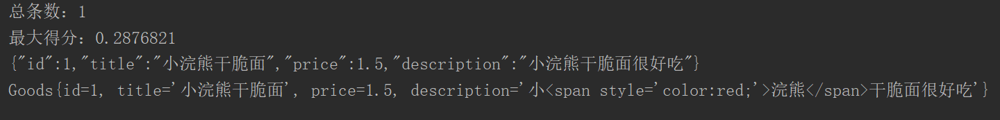

## 聚合查询

### 简介

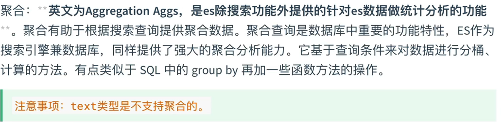

### 测试数据

```json
#创建索引及映射
PUT /fruit
{
  "mappings": {
    "properties": {
      "title":{
        "type": "keyword"
      },
      "price":{
        "type": "double"
      },
      "description":{
        "type": "text",
        "analyzer": "ik_max_word"
      }
    }
  }
}

#添加测试数据
PUT /fruit/_bulk
{"index":{}}
  {"title":"面包","price":19.9,"description":"小面包非常好吃"}
{"index":{}}
  {"title":"旺仔牛奶","price":29.9,"description":"旺仔牛奶非常好喝"}
{"index":{}}
  {"title":"日本豆","price":19.9,"description":"日本豆非常好吃"}  
{"index":{}}
  {"title":"小馒头","price":19.9,"description":"小馒头非常好吃"}
{"index":{}}
  {"title":"大辣片","price":39.9,"description":"大辣片非常好吃"}
{"index":{}}
  {"title":"透心凉","price":9.9,"description":"透心凉非常好喝"}
{"index":{}}
  {"title":"小浣熊","price":19.9,"description":"童年的味道"}  
{"index":{}}
  {"title":"海苔","price":19.9,"description":"海的味道"}
```

### Kibana中使用

#### 根据某个字段分组

```json
#根据price字段，统计数量
#这里的price_group是任意起的名字
GET /fruit/_search
{
  "query": {
    "match_all": {}
  },
  "aggs": {
    "price_group": {
      "terms": {
        "field": "price"
      }
    }
  }
}

#当然也可以根据条件查询后在进行分组
GET /fruit/_search
{
  "query": {
    "term": {
      "description": {
        "value": "非常"
      }
    }
  },
  "aggs": {
    "price_group": {
      "terms": {
        "field": "price"
      }
    }
  }
}
```

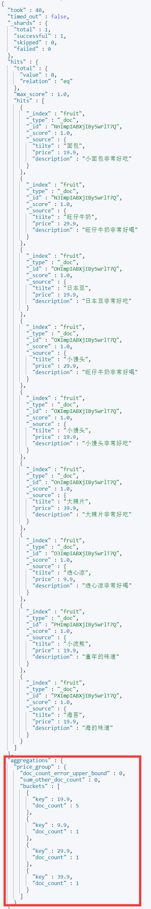

如果不想返回所有的数据，可以通过设置size实现

```json 
#通过设置size:0不让返回所有数据
GET /fruit/_search
{
  "query": {
    "match_all": {}
  },
  "size": 0, 
  "aggs": {
    "price_group": {
      "terms": {
        "field": "price"
      }
    }
  }
}
```

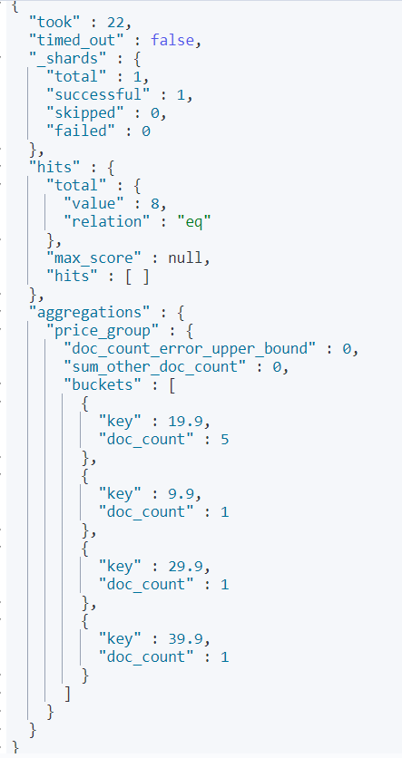

#### 最大值

```json
GET /fruit/_search
{
  "query": {
    "match_all": {}
  },
  "size": 0, 
  "aggs": {
    "max_price": {
      "max": {
        "field": "price"
      }
    }
  }
}
```

#### 最小值

```json
GET /fruit/_search
{
  "query": {
    "match_all": {}
  },
  "size": 0, 
  "aggs": {
    "min_price": {
      "min": {
        "field": "price"
      }
    }
  }
}
```

#### 求和

```json
GET /fruit/_search
{
  "query": {
    "match_all": {}
  },
  "size": 0, 
  "aggs": {
    "sum_price": {
      "sum": {
        "field": "price"
      }
    }
  }
}
```

#### 平均值

```json
GET /fruit/_search
{
  "query": {
    "match_all": {}
  },
  "size": 0, 
  "aggs": {
    "avg_price": {
      "avg": {
        "field": "price"
      }
    }
  }
}
```

### Springboot中应用

#### 基于字段进行聚合查询

```java
package com.example.demo;

import org.elasticsearch.action.search.SearchRequest;
import org.elasticsearch.action.search.SearchResponse;
import org.elasticsearch.client.RequestOptions;
import org.elasticsearch.client.RestHighLevelClient;
import org.elasticsearch.index.query.QueryBuilders;
import org.elasticsearch.search.aggregations.AggregationBuilder;
import org.elasticsearch.search.aggregations.AggregationBuilders;
import org.elasticsearch.search.aggregations.Aggregations;
import org.elasticsearch.search.aggregations.bucket.terms.ParsedDoubleTerms;
import org.elasticsearch.search.aggregations.bucket.terms.ParsedStringTerms;
import org.elasticsearch.search.aggregations.bucket.terms.Terms;
import org.elasticsearch.search.builder.SearchSourceBuilder;
import org.junit.jupiter.api.Test;
import org.springframework.beans.factory.annotation.Autowired;
import org.springframework.boot.test.context.SpringBootTest;

import java.io.IOException;
import java.util.ArrayList;
import java.util.List;
import java.util.Map;

@SpringBootTest
public class DemoAggs {
    @Autowired
    private RestHighLevelClient restHighLevelClient;


    //基于字段的聚合查询，桶中的值是键值对的形式
    @Test
    public void testAggs() throws IOException {
        SearchRequest searchRequest = new SearchRequest("fruit");
        SearchSourceBuilder searchSourceBuilder = new SearchSourceBuilder();
        searchSourceBuilder.query(QueryBuilders.matchAllQuery());//查询条件
//        searchSourceBuilder.aggregation(AggregationBuilders.terms("price_group").field("price"));//设置聚合处理
        searchSourceBuilder.aggregation(AggregationBuilders.terms("title_group").field("title"));//设置聚合处理
        searchSourceBuilder.size(0);
        searchRequest.source(searchSourceBuilder);
        SearchResponse searchResponse = restHighLevelClient.search(searchRequest, RequestOptions.DEFAULT);

        Aggregations aggregations = searchResponse.getAggregations();
        //这里price返回的是double类型，可以直接使用ParsedDoubleTerms接收
//        ParsedDoubleTerms doubleTerms =  aggregations.get("price_group");
//        List<? extends Terms.Bucket> buckets = doubleTerms.getBuckets();

        //这里的title是String类型的，那么就可以使用ParsedStringTerms接收
        ParsedStringTerms stringTerms = aggregations.get("title_group");
        List<? extends Terms.Bucket> buckets = stringTerms.getBuckets();

//        for(Terms.Bucket bucket:buckets) {
        //获取桶中的键值对
//            System.out.println("价格："+bucket.getKey()+"--数量:"+bucket.getDocCount());
//        }

        for(Terms.Bucket bucket:buckets) {
            System.out.println("名称："+bucket.getKey()+"--数量:"+bucket.getDocCount());
        }
    }
}

```

#### MAX MIN AVG SUM

```java
//max(ParsedMax)  min(ParsedMin) sum(ParsedSum) avg(ParsedAvg)
//桶中只有一个返回值
@Test
public void testAggsFunction() throws IOException {
    SearchRequest searchRequest = new SearchRequest("fruit");
    SearchSourceBuilder sourceBuilder = new SearchSourceBuilder();
    sourceBuilder.query(QueryBuilders.matchAllQuery());
    sourceBuilder.aggregation(AggregationBuilders.max("max_price").field("price"));//max
    sourceBuilder.aggregation(AggregationBuilders.min("min_price").field("price"));//min
    sourceBuilder.aggregation(AggregationBuilders.sum("sum_price").field("price"));//sum
    sourceBuilder.aggregation(AggregationBuilders.avg("avg_price").field("price"));//avg
    sourceBuilder.size(0);
    searchRequest.source(sourceBuilder);
    SearchResponse searchResponse = restHighLevelClient.search(searchRequest, RequestOptions.DEFAULT);
    Aggregations aggregations = searchResponse.getAggregations();
    ParsedMax parsedMax = aggregations.get("max_price");//取得最大值
    ParsedMin parsedMin = aggregations.get("min_price");//取得最小值
    ParsedSum parsedSum = aggregations.get("sum_price");//求和
    ParsedAvg parsedAvg = aggregations.get("avg_price");//平均值
    //桶中只有一个返回值，直接取值即可
    System.out.println("最大值"+parsedMax.getValue());
    System.out.println("最小值"+parsedMin.getValue());
    System.out.println("求和"+parsedSum.getValue());
    System.out.println("平均值"+parsedAvg.getValue());
}
```

